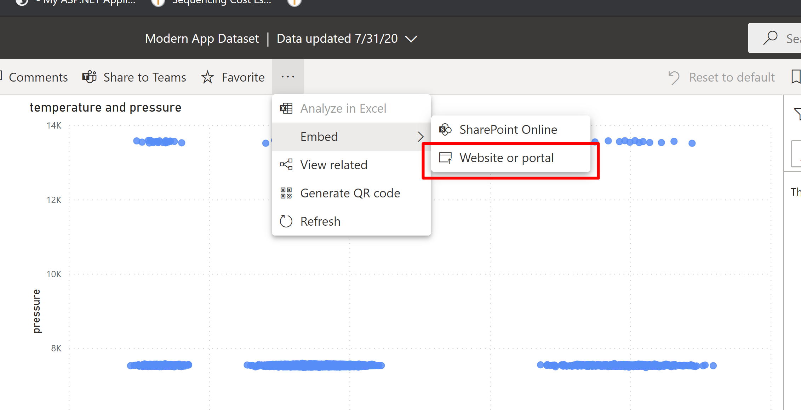
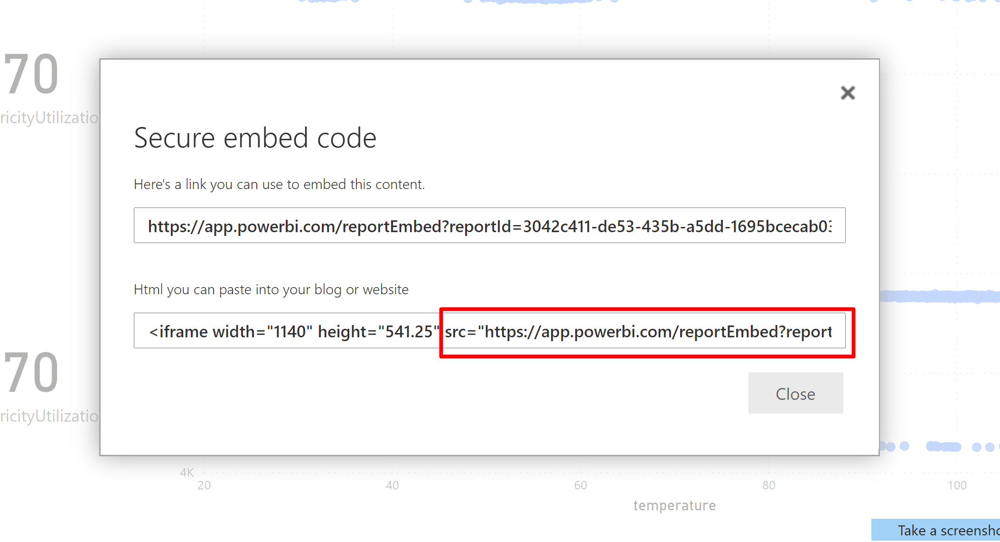
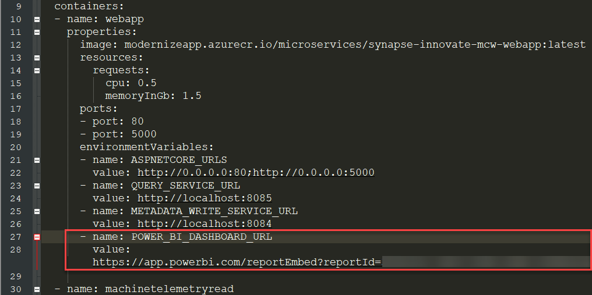
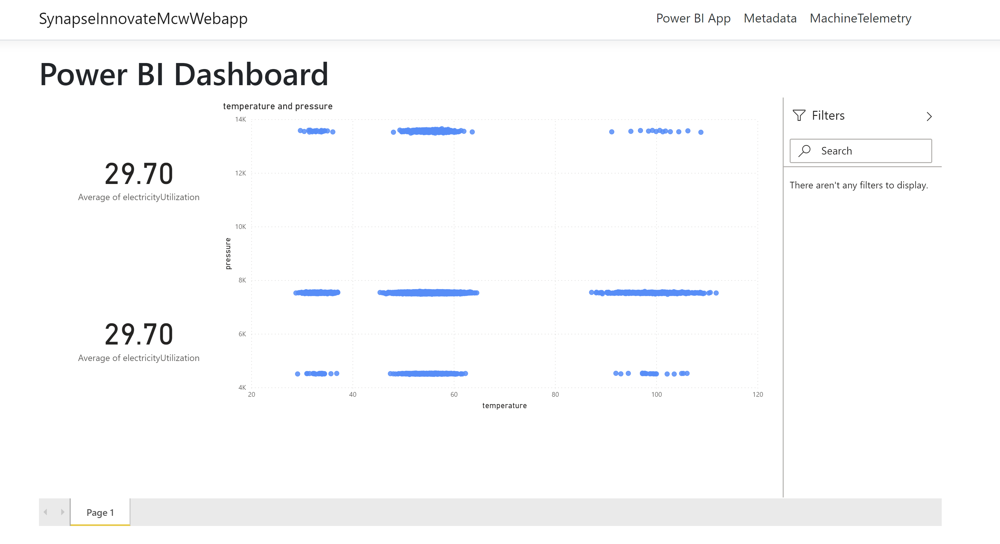

<div class="MCWHeader1">
Innovate and modernize apps with Data and AI
</div>

<div class="MCWHeader2">
Hands-on lab step-by-step
</div>

<div class="MCWHeader3">
August 2020
</div>


Information in this document, including URL and other Internet Web site references, is subject to change without notice. Unless otherwise noted, the example companies, organizations, products, domain names, e-mail addresses, logos, people, places, and events depicted herein are fictitious, and no association with any real company, organization, product, domain name, e-mail address, logo, person, place or event is intended or should be inferred. Complying with all applicable copyright laws is the responsibility of the user. Without limiting the rights under copyright, no part of this document may be reproduced, stored in or introduced into a retrieval system, or transmitted in any form or by any means (electronic, mechanical, photocopying, recording, or otherwise), or for any purpose, without the express written permission of Microsoft Corporation.

Microsoft may have patents, patent applications, trademarks, copyrights, or other intellectual property rights covering subject matter in this document. Except as expressly provided in any written license agreement from Microsoft, the furnishing of this document does not give you any license to these patents, trademarks, copyrights, or other intellectual property.

The names of manufacturers, products, or URLs are provided for informational purposes only and Microsoft makes no representations and warranties, either expressed, implied, or statutory, regarding these manufacturers or the use of the products with any Microsoft technologies. The inclusion of a manufacturer or product does not imply endorsement of Microsoft of the manufacturer or product. Links may be provided to third party sites. Such sites are not under the control of Microsoft and Microsoft is not responsible for the contents of any linked site or any link contained in a linked site, or any changes or updates to such sites. Microsoft is not responsible for webcasting or any other form of transmission received from any linked site. Microsoft is providing these links to you only as a convenience, and the inclusion of any link does not imply endorsement of Microsoft of the site or the products contained therein.

© 2020 Microsoft Corporation. All rights reserved.

Microsoft and the trademarks listed at <https://www.microsoft.com/legal/intellectualproperty/Trademarks/Usage/General.aspx> are trademarks of the Microsoft group of companies. All other trademarks are property of their respective owners.

**Contents** 

<!-- TOC -->

- [Innovate and modernize apps with Data and AI hands-on lab step-by-step](#innovate-and-modernize-apps-with-data-and-ai-hands-on-lab-step-by-step)
  - [Abstract and learning objectives](#abstract-and-learning-objectives)
  - [Overview](#overview)
  - [Solution architecture](#solution-architecture)
  - [Requirements](#requirements)
  - [Before the hands-on lab](#before-the-hands-on-lab)
  - [Exercise 1: Deploy a factory load simulator](#exercise-1-deploy-a-factory-load-simulator)
    - [Task 1: Add a new device in IoT Hub](#task-1-add-a-new-device-in-iot-hub)
    - [Task 2: Install and configure IoT Edge on a Linux virtual machine](#task-2-install-and-configure-iot-edge-on-a-linux-virtual-machine)
    - [Task 3: Build and deploy an IoT Edge module](#task-3-build-and-deploy-an-iot-edge-module)
  - [Exercise 2: Use Azure Machine Learning to train and register a predictive maintenance model](#exercise-2-use-azure-machine-learning-to-train-and-register-a-predictive-maintenance-model)
    - [Task 1: Load historical maintenance data](#task-1-load-historical-maintenance-data)
    - [Task 2: Create a new Azure Machine Learning Datastore](#task-2-create-a-new-azure-machine-learning-datastore)
    - [Task 3: Develop the predictive maintenance model](#task-3-develop-the-predictive-maintenance-model)
    - [Task 4: Deploy the predictive maintenance model](#task-4-deploy-the-predictive-maintenance-model)
    - [Task 5: Test the predictive maintenance model](#task-5-test-the-predictive-maintenance-model)
  - [Exercise 3:  Create an Azure Function to send event telemetry to Cosmos DB](#exercise-3-create-an-azure-function-to-send-event-telemetry-to-cosmos-db)
    - [Task 1: Enable Azure Synapse Link for Cosmos DB](#task-1-enable-azure-synapse-link-for-cosmos-db)
    - [Task 2: Create Cosmos DB containers](#task-2-create-cosmos-db-containers)
    - [Task 3: Create an Azure Function to write event data to Cosmos DB](#task-3-create-an-azure-function-to-write-event-data-to-cosmos-db)
    - [Task 4: Deploy and configure an Azure Function](#task-4-deploy-and-configure-an-azure-function)
  - [Exercise 4:  Enrich event telemetry with predictive maintenance results](#exercise-4-enrich-event-telemetry-with-predictive-maintenance-results)
    - [Task 1:  Create an Event Hub](#task-1-create-an-event-hub)
    - [Task 2: Create an events table in PostgreSQL](#task-2-create-an-events-table-in-postgresql)
    - [Task 3: Create an Azure Function based on a Cosmos DB trigger](#task-3-create-an-azure-function-based-on-a-cosmos-db-trigger)
  - [Exercise 5:  Enrich event telemetry with automated anomaly detection](#exercise-5-enrich-event-telemetry-with-automated-anomaly-detection)
    - [Task 1: Create an Azure Stream Analytics job](#task-1-create-an-azure-stream-analytics-job)
  - [Exercise 6:  Send scored telemetry data to PostgreSQL](#exercise-6-send-scored-telemetry-data-to-postgresql)
    - [Task 1: Create an Azure Function to write temperature anomalies data to PostgreSQL](#task-1-create-an-azure-function-to-write-temperature-anomalies-data-to-postgresql)
    - [Task 2: Deploy and configure an Azure Function](#task-2-deploy-and-configure-an-azure-function)
  - [Exercise 7: Modernize services logic to use event sourcing and CQRS](#exercise-7-modernize-services-logic-to-use-event-sourcing-and-cqrs)
    - [Task 1: Build and push the containers](#task-1-build-and-push-the-containers)
    - [Task 2: Create a deployment file](#task-2-create-a-deployment-file)
    - [Task 3: Deploy the container group](#task-3-deploy-the-container-group)
    - [Task 4: Migrate the Change Feed Processor Function to a Container](#task-4-migrate-the-change-feed-processor-function-to-a-container)
  - [Exercise 8: View the factory status in a Power BI report](#exercise-8-view-the-factory-status-in-a-power-bi-report)
    - [Task 1: Import events data via a Spark notebook](#task-1-import-events-data-via-a-spark-notebook)
    - [Task 2: Create a Power BI notebook](#task-2-create-a-power-bi-notebook)
    - [Task 3: Embed the Power BI notebook](#task-3-embed-the-power-bi-notebook)
  - [After the hands-on lab](#after-the-hands-on-lab)
    - [Task 1: Delete Lab Resources](#task-1-delete-lab-resources)
    - [Task 2:  Delete the Power BI Workspace](#task-2-delete-the-power-bi-workspace)

<!-- /TOC -->

# Innovate and modernize apps with Data and AI hands-on lab step-by-step

## Abstract and learning objectives

In this hands-on-lab, you will build a cloud processing and machine learning solution for IoT data. We will begin by deploying a factory load simulator using Azure IoT Edge to write into Azure IoT Hub, following the recommendations in the [Azure IoT reference architecture](https://docs.microsoft.com/azure/architecture/reference-architectures/iot).  The data in this simulator represents sensor data collected from a stamping press machine, which cuts, shapes, and imprints sheet metal.  The rest of the lab will show how to implement an event sourcing architecture using Azure technologies ranging from Cosmos DB to Stream Analytics to Azure Functions to Azure Database for PostgreSQL.

Using factory-generated data, you will learn how to use the Anomaly Detection service built into Stream Analytics to observe and report on abnormal machine temperature readings.  You will also learn how to apply historical machine temperature and stamping pressure values in the creation of a machine learning model to identify potential issues which might require machine adjustment.  You will deploy this predictive maintenance model and generate predictions on simulated stamp press data.

## Overview

The Innovate and Modernize Apps with Data & AI hands-on lab is an exercise that will challenge you to implement an end-to-end scenario using the supplied example that is based on Azure IoT Hub and other related Azure services. The hands-on lab can be implemented on your own, but it is highly recommended to pair up with other members at the lab to model a real-world experience and to allow each member to share their expertise for the overall solution.

## Solution architecture


The solution begins with multiple IoT devices, located within multiple factories, that securely connect to Azure IoT Hub to send telemetry. IoT Hub provides IoT device management, telemetry ingest at high volume, and the ability to send commands to devices as needed. IoT Edge allows individual manufacturing machines to interact with IoT Hub by sending telemetry messages to IoT Hub and by ensuring that edge devices are running the latest versions of deployed modules. Telemetry from IoT Hub automatically triggers an Azure function, which processes the events, assigns a unique `entity_id`, and stores them in an Azure Cosmos DB telemetry container. The document TTL (time-to-live) is set to 30 days, after which time they will automatically expire. The data is replicated long-term to the analytical store with no TTL. The analytical store saves all transactional data in columnar storage as Parquet files in Azure storage in a cost-effective way, automatically. No ETL required. A different Azure function implements event sourcing by triggering off the Azure Cosmos DB change feed for additional processing, including predictive maintenance scoring via a custom-trained Machine Learning model deployed to Azure Kubernetes Service (AKS) for real-time scoring. The function sends the scored data to an Azure Event Hub. Another function that consumes the change feed and saves the event data to domain entities, including state data, and stores them in Azure PostgreSQL Hyperscale (Citus). This database stores all sensor data as domain entities, partitioned by device Id, which the Hyperscale features uses to automatically shard the data for horizontal scaling and high performance reads and writes. An Azure Stream Analytics job reads the device telemetry, which includes the predictive maintenance prediction, and applies additional processing through a SQL-like query language. It uses an Azure Cognitive Services Anomaly Detector service to perform Changepoint and Spike-and-Dip anomaly detection. It also performs windowed aggregate queries against the time series data to create aggregates on machine maintenance predictions, grouped by maintenance requirement, factory, and machine. The temperature anomalies, telemetry with predictive maintenance scores, and temperature anomaly data is saved to another Azure Cosmos DB container, named `scored_telemetry`. Another Azure function implements event sourcing by triggering off the Azure Cosmos DB change feed from the `scored_telemetry` container. It saves the anomaly detection, windowed aggregates, and scored predictive maintenance event data to domain entities, including state data, and writes them to Azure PostgreSQL.

An Azure Synapse Analytics workspace securely connects to Azure Cosmos DB through a linked service, and uses the Synapse Link feature to access both the transactional store (OLTP) and analytical store (OLAP) of each Azure Cosmos DB container. The analytical store is optimized for read-heavy queries, which do not consume Azure Cosmos DB resource units (RUs), as opposed to reading the transactional store. All raw historical event data is accessible through the analytical store, which serves as the data lake, but with no ETL requirements. Synapse Spark notebooks read the analytical store to perform Machine Learning model training and deployments through Azure Machine Learning, data exploration, and batch scoring. Synapse pipelines are used for batch processing at scale over data fed into the analytical store from IoT devices originating from all factories. Wide World Importers data analysts use the Power BI integration capabilities of Synapse Analytics to create reports against Synapse Serverless views that display data from the analytical stores, as well as data stored in the SQL Pools. These reports are also embedded in the web application, making them available to end-users who do not have access to the Synapse Analytics workspace or Power BI online.

The web app is a modernized version of WWI's old monolithic web app, implementing a microservices pattern through Docker containers deployed to Azure. The CQRS pattern is applied by separating create, update, and delete (CUD) commands from query (read) commands, issued by microservices deployed to different containers. The metadata command microservice, for example, issues CUD commands to the `metadata` Azure Cosmos DB container. Factory, machine, maintenance criteria, and other metadata are stored in this container. A query microservice issues read requests to read microservices for telemetry data stored in Azure PostgreSQL, and metadata stored in Azure Cosmos DB.

## Requirements

1. Microsoft Azure subscription must be pay-as-you-go or MSDN.

    a. Trial subscriptions will not work.

2. Install [Visual Studio Code](https://code.visualstudio.com/).

    a. Install the [Azure IoT Tools extension](https://marketplace.visualstudio.com/items?itemName=vsciot-vscode.azure-iot-tools).

    b. Install the [C# for Visual Studio Code extension](https://marketplace.visualstudio.com/items?itemName=ms-dotnettools.csharp).

    c. Install the [Azure Functions extension](https://marketplace.visualstudio.com/items?itemName=ms-azuretools.vscode-azurefunctions).

3. Install [the Azure Machine Learning SDK for Python](https://docs.microsoft.com/python/api/overview/azure/ml/install?view=azure-ml-py).

4. Install [Azure Data Studio](https://docs.microsoft.com/sql/azure-data-studio/download-azure-data-studio).

    a. Install the [PostgreSQL extension](https://docs.microsoft.com/sql/azure-data-studio/postgres-extension).

5. Install Docker. [Docker Desktop](https://www.docker.com/products/docker-desktop) will work for this hands-on lab and supports Windows and MacOS. For Linux, install the Docker engine through your distribution's package manager.

6. Install [Power BI Desktop](https://aka.ms/pbidesktopstore).

## Before the hands-on lab

Refer to the Before the hands-on lab setup guide manual before continuing to the lab exercises.

## Exercise 1: Deploy a factory load simulator

Duration: 40 minutes

[Azure IoT Hub](https://azure.microsoft.com/services/iot-hub/) is a Microsoft offering which provides secure and reliable communication between IoT devices and cloud services in Azure. The aim of this service is to provide bidirectional communication at scale. The core focus of many industrial companies is not on cloud computing; therefore, they do not necessarily have the personnel skilled to provide guidance and to stand up a reliable and scalable infrastructure for an IoT solution. It is imperative for these types of companies to enter the IoT space not only for the cost savings associated with remote monitoring, but also to improve safety for their workers and the environment.

Wide World Importers is one such company that could use a helping hand entering the IoT space.  They have an existing suite of sensors and on-premises data collection mechanisms at each factory but would like to centralize data in the cloud. To achieve this, we will stand up a IoT Hub and assist them with the process of integrating existing sensors with IoT Hub via [Azure IoT Edge](https://azure.microsoft.com/services/iot-edge/). A [predictable cost model](https://azure.microsoft.com/pricing/details/iot-hub/) also ensures that there are no financial surprises.

### Task 1: Add a new device in IoT Hub

The first task is to register a new IoT Edge device in IoT Hub.

1. Navigate to the **modernize-app** resource group in the [Azure portal](https://portal.azure.com).

    

    If you do not see the resource group in the Recent resources section, type in "resource groups" in the top search menu and then select **Resource groups** from the results.

    

    From there, select the **modernize-app** resource group.

2. Navigate to the IoT Hub you created. The name will start with **modernize-app-iot** and have a Type of **IoT Hub**.

3. In the Automatic Device Management menu, select **IoT Edge**. Then select the **+ Add an IoT Edge device** button to register a new device.

    

4. In the Create a device menu, name the device `modernize-app-ubuntu1` and leave the remaining settings the same.

    

5. Select **Save** to complete device registration.

6. Select the device named `modernize-app-ubuntu1`.

    

7. On the modernize-app-ubuntu1 screen, copy the **Primary Connection String** and paste it into Notepad or another text editor. You will use this connection string in the next task, when configuring a Linux virtual machine to become `modernize-app-ubuntu1`.

    

8. Select **Built-in endpoints** from the Settings menu and navigate to the **Event Hub compatible endpoint** section. Copy the Event Hub-compatible endpoint and paste it into Notepad or another text editor. You will use this endpoint in Exercise 3.

    

9. In the Consumer Groups section, add a new consumer group named **telemetry** by entering the name into the **Create new consumer group** textbox.  IoT Hub will automatically save and register this consumer group, which we will use in Exercise 3.

    

### Task 2: Install and configure IoT Edge on a Linux virtual machine

The instructions in this task come from the guide on [how to install IoT Edge on Linux](https://docs.microsoft.com/azure/iot-edge/how-to-install-iot-edge-linux). The instructions in this task are tailored specifically for Ubuntu Server 18.04, but if you wish to install IoT Edge on other variants of Linux, including Rasbian for the Raspberry Pi, the linked article will provide additional support.

1. Use SSH to connect to the virtual machine you configured before the hands-on lab. If you do not have the IP address of the virtual machine, navigate to the **modernize-app** resource group and search for the name **modernize-app-vm** with a Type of **Virtual machine**.

    

    The public IP address will be visible on the Overview page for the virtual machine. Connect to this IP address using your private key and the built-in `ssh` command in Windows 10 version 1709 or later, Linux, and MacOS; or PuTTY on any version of Windows.

    

2. Run the following commands to register the Microsoft key and software repository feed, copy the generated list into `sources.list.d`, and install the Microsoft GPG public key.

    ```bash
    curl https://packages.microsoft.com/config/ubuntu/18.04/multiarch/prod.list > ./microsoft-prod.list
    sudo cp ./microsoft-prod.list /etc/apt/sources.list.d/
    curl https://packages.microsoft.com/keys/microsoft.asc | gpg --dearmor > microsoft.gpg
    sudo cp ./microsoft.gpg /etc/apt/trusted.gpg.d/
    ```

3. Update the APT package list and install the Moby engine and command-line interface.

    ```bash
    sudo apt-get update
    sudo apt-get install -y moby-engine
    sudo apt-get install -y moby-cli
    ```

    

4. Install the latest version of Azure IoT Edge.

    ```bash
    sudo apt-get update
    sudo apt-get install -y iotedge
    ```

    

5. As the console message at the end of step 4 indicates, we will need to modify a configuration file. The configuration file is read-only by default, so you will need to use `chmod` to make it writable. Then, using a text editor like `vim` or `nano`, modify the configuration file.

    ```bash
    sudo chmod +w /etc/iotedge/config.yaml
    sudo vim /etc/iotedge/config.yaml
    ```

    Inside the configuration file, scroll down to the lines labeled:

    ```bash
    # Manual provisioning configuration
    provisioning:
        source: "manual"
        device_connection_string: "<ADD DEVICE CONNECTION STRING HERE>"
    ```

    Replace the **<ADD DEVICE CONNECTION STRING HERE>** text with the connection string you copied in the prior task.  In vim, use the arrow keys to move the cursor to the point before the angle bracket `<` and then type `35x` to delete the next 35 characters, leaving you with an empty pair of quotation marks. Then, type `i` to insert, paste in your text by right-clicking the screen (if supported) or `Shift+Insert`. Once you have your connection string pasted into the editor, press `Esc` to exit insert mode and type `ZZ` to save the file.

    >**Note**: `vim` is one editor you may use to modify files in Linux, but there are others, including `nano`.  Choose the one you are most comfortable using.

    

6. Restart the IoT Edge service.

    ```bash
    sudo systemctl restart iotedge
    ```

    To confirm that this worked successfully, return to the modernize-app-ubuntu1 device in IoT Hub and you should see a runtime response of **417 -- The device's deployment configuration is not set** within one to two minutes. You may need to select **Refresh** to update the page.

    

    Although the runtime response reports an error message, this is a good result--the 417 error message indicates that we have not installed any IoT Edge modules on the device, and that is what we will do in the next task.

### Task 3: Build and deploy an IoT Edge module

1. Open Visual Studio Code. Navigate to the **Command Palette** by selecting it from the View menu, or by pressing `Ctrl+Shift+P`. Select the option **Azure IoT Edge: New IoT Edge Solution**. If you do not see it, begin typing "Azure IoT Edge" and it should appear.

    > **Note**: If you do not see anything in the Command Palette for Azure IoT Edge, be sure to install the [Azure IoT Tools extension](https://marketplace.visualstudio.com/items?itemName=vsciot-vscode.azure-iot-tools) for Visual Studio Code.

    

2. Select a folder for your IoT Edge solution, such as `C:\Temp\IoT Edge`. When you have created or found a suitable folder, select **Select Folder**.

    

3. Enter `WWIFactorySensors` as the name for your solution.

    

4. In the Select Module Template menu, choose **C# Module**.

    

5. In the Provide a Module Name menu, enter `WWIFactorySensorModule` for the name.

    

6. Provide the location of your Azure Container Registry instance.

    

    If you do not know the public address of your Azure Container Registry instance, navigate to the **modernize-app** resource group in the [Azure portal](https://portal.azure.com). From there, select the resource of type **Container registry**.

    

    Copy the **Login server** and replace `localhost:5000` with this address.

    

7. Install any required assets to build the factory sensor solution by selecting **Yes** to the following prompt.

    

8. Open the `.env` file and ensure that the container registry username and password are correct.

    

    If you are not sure what the values should be, navigate to the container registry and then select **Access keys** from the Settings menu.

    

9. Replace the contents of **deployment.template.json** and **deployment.debug.template.json** with the following JSON. Replace the **modernizeapp** on lines 14, 15, and 16 with the name of your container registry.

    ```json
    {
    "$schema-template": "2.0.0",
    "modulesContent": {
        "$edgeAgent": {
        "properties.desired": {
            "schemaVersion": "1.0",
            "runtime": {
            "type": "docker",
            "settings": {
                "minDockerVersion": "v1.25",
                "loggingOptions": "",
                "registryCredentials": {
                "modernizeapp": {
                    "username": "$CONTAINER_REGISTRY_USERNAME_modernizeapp",
                    "password": "$CONTAINER_REGISTRY_PASSWORD_modernizeapp",
                    "address": "modernizeapp.azurecr.io"
                }
                }
            }
            },
            "systemModules": {
            "edgeAgent": {
                "type": "docker",
                "settings": {
                "image": "mcr.microsoft.com/azureiotedge-agent:1.0",
                "createOptions": {}
                }
            },
            "edgeHub": {
                "type": "docker",
                "status": "running",
                "restartPolicy": "always",
                "settings": {
                "image": "mcr.microsoft.com/azureiotedge-hub:1.0",
                "createOptions": {
                    "HostConfig": {
                    "PortBindings": {
                        "5671/tcp": [
                        {
                            "HostPort": "5671"
                        }
                        ],
                        "8883/tcp": [
                        {
                            "HostPort": "8883"
                        }
                        ],
                        "443/tcp": [
                        {
                            "HostPort": "443"
                        }
                        ]
                    }
                    }
                }
                }
            }
            },
            "modules": {
            "WWIFactorySensorModule": {
                "version": "1.0.1",
                "type": "docker",
                "status": "running",
                "restartPolicy": "always",
                "settings": {
                "image": "${MODULES.WWIFactorySensorModule}",
                "createOptions": {}
                }
            }
            }
        }
        },
        "$edgeHub": {
        "properties.desired": {
            "schemaVersion": "1.0",
            "routes": {
            "WWIFactorySensorModuleToIoTHub": "FROM /messages/modules/WWIFactorySensorModule/outputs/* INTO $upstream"
            },
            "storeAndForwardConfiguration": {
            "timeToLiveSecs": 7200
            }
        }
        }
    }
    }
    ```

10. Open the **modules\WWIFactorySensorModule** folder and open **module.json**. Ensure that the **repository** in line 5 is correct.

    

11. Open the **Program.cs** file. Replace its contents with the following code.

    ```csharp
    namespace WWIFactorySensorModule
    {
        using System;
        using System.IO;
        using System.Runtime.InteropServices;
        using System.Runtime.Loader;
        using System.Security.Cryptography.X509Certificates;
        using System.Text;
        using System.Threading;
        using System.Threading.Tasks;
        using Microsoft.Azure.Devices.Client;
        using Microsoft.Azure.Devices.Client.Transport.Mqtt;

        using System.Collections.Generic;
        using Microsoft.Azure.Devices.Shared;
        using Newtonsoft.Json;
        using Newtonsoft.Json.Linq;

        public class Program
        {
            // Each message sent to IoT Hub will have this shape
            class MessageBody
            {
                public int factoryId {get; set;}
                public Machine machine {get;set;}
                public Ambient ambient {get; set;}
                public string timeCreated {get; set;}
            }
            class Machine
            {
                public int machineId {get; set;}
                public double temperature {get; set;}
                public double pressure {get; set;}
                public double electricityUtilization {get; set;}
            }
            class Ambient
            {
                public double temperature {get; set;}
                public int humidity {get; set;}
            }

            public int Interval { get; private set; }
            public string OutputChannelName { get; private set; }

            static async Task Main(string[] args)
            {
                var module = new Program();
                await module.Run();
            }

            public async Task Run()
            {
                var cancellationTokenSource = new CancellationTokenSource();
                // Unloading assembly or Ctrl+C will trigger cancellation token
                AssemblyLoadContext.Default.Unloading += (ctx) => cancellationTokenSource.Cancel();
                Console.CancelKeyPress += (sender, cpe) => cancellationTokenSource.Cancel();

                try
                {
                    // Use an environment variable or the defaults
                    Interval = 5000; // Generate a new message every 5 seconds.
                    int interval;
                    if (Int32.TryParse(Environment.GetEnvironmentVariable("Interval"), out interval))
                        Interval = interval;
                    OutputChannelName = Environment.GetEnvironmentVariable("OutputChannelName") ?? "output1";

                    MqttTransportSettings mqttSetting = new MqttTransportSettings(TransportType.Mqtt_Tcp_Only);
                    ITransportSettings[] settings = { mqttSetting };

                    // Open a connection to the Edge runtime
                    using (var moduleClient = await ModuleClient.CreateFromEnvironmentAsync(settings))
                    {
                        await moduleClient.OpenAsync(cancellationTokenSource.Token);
                        Console.WriteLine("IoT Hub module client initialized.");

                        await moduleClient.SetDesiredPropertyUpdateCallbackAsync(DesiredPropertyUpdateHandler, moduleClient, cancellationTokenSource.Token);

                        // Fire the DesiredPropertyUpdateHandler manually to read initial values
                        var twin = await moduleClient.GetTwinAsync();
                        await DesiredPropertyUpdateHandler(twin.Properties.Desired, moduleClient);

                        Random rand = new Random();
                        while (!cancellationTokenSource.IsCancellationRequested)
                        {
                            // Generate new data to send as a message
                            var msg = GenerateNewMessage(rand);
                            var messageString = JsonConvert.SerializeObject(msg);
                            var messageBytes = Encoding.UTF8.GetBytes(messageString);

                            await moduleClient.SendEventAsync(OutputChannelName, new Message(messageBytes));
                            await Task.Delay(Interval, cancellationTokenSource.Token);
                        }
                    }
                }
                catch (TaskCanceledException)
                {
                    Console.WriteLine("Asynchronous operation cancelled.");
                }

                Console.WriteLine("IoT Hub module client exiting.");
            }

            // Simulate factory activity to create a new message
            private MessageBody GenerateNewMessage(Random rand)
            {
                // This sensor will be attached to machine 12345
                var machine = new Machine { machineId = 12345 };
                // Create values for temperature, stamp pressure, and electricity utilization
                machine.temperature = GenerateDoubleValue(rand, 55.0, 2.4);
                machine.pressure = GenerateDoubleValue(rand, 7539, 14);
                machine.electricityUtilization = GenerateDoubleValue(rand, 29.36, 1.1);

                // This represents conditions around the stamp press: the current temperature and humidity levels of the room itself
                var ambient = new Ambient();
                ambient.temperature = GenerateDoubleValue(rand, 22.6, 1.1);
                ambient.humidity = Convert.ToInt32(GenerateDoubleValue(rand, 20.0, 3.5));

                // The machine is in factory 1
                return new MessageBody
                {
                    factoryId = 1,
                    machine = machine,
                    ambient = ambient,
                    timeCreated = DateTime.UtcNow.ToString("yyyy-MM-ddTHH:mm:ssZ")
                };
            }

            // Returned values generally follow a normal distribution and we pass in the mean and standard deviation,
            // but occasionally we will get anomalies which report values well outside the expectations for this distribution
            private double GenerateDoubleValue(Random rand, double mean, double stdDev, double likelihoodOfAnomaly = 0.06)
            {
                double u1 = rand.NextDouble();

                double res = BoxMullerTransformation(rand, mean, stdDev);

                if (u1 <= likelihoodOfAnomaly / 2.0)
                {
                    // Generate a negative anomaly
                    res = res * 0.6;
                }
                else if (u1 > likelihoodOfAnomaly / 2.0 && u1 <= likelihoodOfAnomaly)
                {
                    // Generate a positive anomaly
                    res = res * 1.8;
                }

                return res;
            }

            private double BoxMullerTransformation(Random rand, double mean, double stdDev)
            {
                double u1 = 1.0 - rand.NextDouble();
                double u2 = 1.0 - rand.NextDouble();
                double randStdNormal = Math.Sqrt(-2.0 * Math.Log(u1)) * Math.Sin(2.0 * Math.PI * u2);
                return mean + stdDev * randStdNormal;
            }

            private async Task DesiredPropertyUpdateHandler(TwinCollection desiredProperties, object userContext)
            {
                var moduleClient = userContext as ModuleClient;

                if (desiredProperties.Contains("OutputChannel"))
                {
                    OutputChannelName = desiredProperties["OutputChannel"];
                }
                if (desiredProperties.Contains("Interval"))
                {
                    Interval = desiredProperties["Interval"];
                }
                var reportedProperties = new TwinCollection(new JObject(), null);
                reportedProperties["OutputChannel"] = OutputChannelName;
                reportedProperties["Interval"] = Interval;
                await moduleClient.UpdateReportedPropertiesAsync(reportedProperties);

            }

            public async Task<byte[]> ReadAllBytesAsync(string filePath, CancellationToken cancellationToken)
            {
                const int bufferSize = 4096;
                using (FileStream sourceStream = new FileStream(filePath,
                    FileMode.Open, FileAccess.Read, FileShare.Read,
                    bufferSize: bufferSize, useAsync: true))
                {
                    byte[] data = new byte[sourceStream.Length];
                    int numRead = 0;
                    int totalRead = 0;

                    while ((numRead = await sourceStream.ReadAsync(data, totalRead, Math.Min(bufferSize,(int)sourceStream.Length-totalRead), cancellationToken)) != 0)
                    {
                    totalRead += numRead;
                    }
                    return data;
                }
            }
        }
    }
    ```

12. Navigate to the **Command Palette** by selecting it from the View menu, or by pressing `Ctrl+Shift+P`. Select the option **Azure IoT Edge: Set Default Target Platform for Edge Solution**.

    

13. Select **amd64** from the target platform menu. Be sure not to select windows-amd64, as the sensor will deploy to a Linux machine.

    

14. Navigate to the Terminal and enter the following command:

    ```powershell
    docker login -u <USERNAME> -p "<PASSWORD>" <CONTAINER_REGISTRY>
    ```

    Enter appropriate values for username, password, and container registry. The values for username and password are stored in the .env file.

    

15. Right-click on **deployment.template.json** and select **Build and Push IoT Edge Solution**. This may take several minutes depending upon the speed of your internet connection. The terminal will include the current status of each Docker image layer. When everything is **Pushed**, continue to the next step.

    

16. Navigate to the Azure IoT Hub section and select your IoT Hub by selecting the **...** menu option and choosing **Select IoT Hub**. Choose your subscription and IoT Hub and it will appear in the Azure IoT Hub section.

    

17. Right-click on the `modernize-app-ubuntu1` device and select **Create Deployment for Single Device**.

    

18. In the **Open** menu, navigate to  the **config** folder and select **deployment.amd64.json** and then select **Select Edge Deployment Manifest**.

    

    > **Note**: It is important that you not select the `deployment.template.json` or `deployment.debug.template.json` files. These are template JSON files which do not contain any sensitive details. These are the files that you can safely check into source control. Visual Studio Code uses these templates as the basis for the proper deployment files in the **config** folder. You should not check in files in the config folder.

19. Navigate back to the IoT Hub (referring back to Task 1 if needed), and then return to the IoT Edge entry in Automatic Device Management. Select the entry labeled **modernize-app-ubuntu1** and you should see an IoT Edge Runtime Response of **200 -- OK** and four deployed modules, including the **WWIFactorySensorModule**.

    

## Exercise 2: Use Azure Machine Learning to train and register a predictive maintenance model

Duration: 40 minutes

Now that your data is streaming into Azure IoT Hub, it is time to train and build a model to predict whether machine maintenance is required. This model will become a valuable part of data enrichment in Exercise 4.

### Task 1: Load historical maintenance data

1. Open the hands-on lab's Resources\Synapse directory and confirm that you have a file called **HistoricalMaintenanceRecord.csv**.

2. Navigate to the **modernize-app** resource group in the [Azure portal](https://portal.azure.com).

    

    If you do not see the resource group in the Recent resources section, type in "resource groups" in the top search menu and then select **Resource groups** from the results.

    

    From there, select the **modernize-app** resource group.

3. Select the **modernizeappstorage#SUFFIX#** storage account which you created before the hands-on lab. Note that there may be multiple storage accounts, so be sure to choose the one you created.

    

4. In the **Data Lake Storage** section, select **Containers**. Then, select the **synapse** container you created before the hands-on lab.

    

5. In the synapse container, select **+ Add Directory**. Enter **maintenancedata** for the name and select **Save**. Then, add another directory named **models**.

6. Navigate to the **maintenancedata** directory and select the **Upload** option. In the Files section, select the folder icon to upload files. Navigate to where you saved **HistoricalMaintenanceRecord.csv** and choose this file for upload. Then select **Upload** to finish uploading the file.

    

### Task 2: Create a new Azure Machine Learning Datastore

1. Navigate to the **modernize-app** resource group in the [Azure portal](https://portal.azure.com).

2. Select the **modernize-app-#SUFFIX#** resource with a Type of **Machine Learning**.

    

3. Select **Launch now** to open the Azure Machine Learning studio.

    

4. In the Azure Machine Learning studio, select the **Datastores** option in the Manage tab. Then, select the **+ New datastore** option.

    

5. In the **New datastore** window, complete the following:

   | Field                          | Value                                              |
   | ------------------------------ | ------------------------------------------         |
   | Datastore name                 | _`modernizeappstorage`_                            |
   | Datastore type                 | _select `Azure Blob Storage`_                      |
   | Account selection method       | _select `From Azure subscription`_                 |
   | Subscription ID                | _select the appropriate subscription_              |
   | Storage account                | _select `modernizeappstorage#SUFFIX#`_             |
   | Blob container                 | _select `synapse`_                                 |
   | Allow Azure ML Service...      | _select `No`_                                      |
   | Authentication type            | _select `Account key`_                             |
   | Account key                    | _enter the account key_                            |

   

   >**Note**: If you have not stored your storage account key, navigate to your storage account. Then, in the **Settings** menu, select **Access keys** and copy the **Key** value in the **key1** section.

6. Select **Create** to add the new output.

### Task 3: Develop the predictive maintenance model

1. Navigate to the **Notebooks** section and then select the **Create new file** option.

    

2. Enter the name **Stamp Press Maintenance Model** and select **Notebook** as the file type.  Then select **Create** to create the notebook.

    

3. In the Compute menu, select **+** to add new compute.

    

4. In the **New compute instance** section, complete the following and then select **Create**.

   | Field                          | Value                                              |
   | ------------------------------ | ------------------------------------------         |
   | Compute name                   | _`modernizeapp`_                                   |
   | Virtual machine type           | _select `CPU (Central Processing Unit)`_           |
   | Virtual machine size           | _select `Standard_DS3_v2`_                         |

   

5. Copy and paste the following code into the notebook code block.

    ```python
    from azureml.core import Workspace, Environment, Datastore
    from azureml.core.experiment import Experiment
    from azureml.core.run import Run
    from azureml.core.model import Model

    from sklearn.tree import DecisionTreeClassifier
    from sklearn.model_selection import cross_val_score, train_test_split
    from sklearn.metrics import accuracy_score
    import joblib
    import numpy as np
    import pandas as pd

    ws = Workspace.from_config()

    # Load data
    ds = Datastore.get(ws, "modernizeappstorage")
    ds.download(".", prefix="maintenancedata/HistoricalMaintenanceRecord.csv")
    f = open("maintenancedata/HistoricalMaintenanceRecord.csv")
    data = np.loadtxt(f, delimiter=",")
    df = pd.DataFrame(data=data, columns=['Pressure','MachineTemperature','Label'])
    X = df[['Pressure','MachineTemperature']]
    y = df[['Label']]
    X_train, X_test, y_train, y_test = train_test_split(X, y, random_state=1)

    # Begin experiment
    experiment = Experiment(workspace=ws, name="Stamp_Press_Experiment")
    run = experiment.start_logging()

    # Fit the data to a decision tree
    clf = DecisionTreeClassifier()
    clf.fit(X_train, y_train)

    # Try the model on the hold-out data set and print accuracy.
    y_predict = clf.predict(X_test)
    accuracy = accuracy_score(y_test, y_predict)

    # Log the accuracy
    run.log('Accuracy', accuracy)

    print()
    print('#############################')
    print('Accuracy is {}'.format(accuracy))
    print('#############################')
    print()

    # Save the model and upload it to the run
    model_file_name = 'outputs/model.pkl'
    joblib.dump(value = clf, filename = model_file_name)
    run.upload_file(name = model_file_name, path_or_stream = model_file_name)

    # Complete the run
    run.complete()

    # Register the model with the workspace
    model = run.register_model(model_name = 'stamp_press_model', model_path = model_file_name)
    ```

6. After the **Compute** has been created, select **Run cell** on the cell. This will train and test a predictive maintenance model and then register the final model with Azure ML.

    

    You may receive a prompt to sign in. If you do, copy the code in your notebook and then select the link to authenticate.

    

    After selecting the link, enter the code and select **Next**. You may be prompted to select an account; if so, choose your Azure account and continue.

    

    Once you have authenticated, the code will run and return a result for accuracy. This result should be approximately 94-95%.

### Task 4: Deploy the predictive maintenance model

1. Navigate to the **Models** section and then select **stamp_press_model**.

    

2. On the model's page, select **Deploy** to deploy the model.

    

    >**Note**: in a production scenario, you will likely wish to use [Azure Machine Learning's MLOps](https://azure.microsoft.com/services/machine-learning/mlops/) instead of deploying models by hand through Azure ML Studio.

3. In the **Deploy a model** section, complete the following and then select **Deploy**. The **Entry script file** and **Conda dependencies file** are located in the folder containing hands-on lab resources, in the **Resources\Azure ML** directory.

   | Field                          | Value                                              |
   | ------------------------------ | ------------------------------------------         |
   | Name                           | _`stamp-press-model`_                              |
   | Compute type                   | _select `Azure Container Instance`_                |
   | Entry script file              | _navigate to and select `score.py`_                |
   | Conda dependencies file        | _navigate to and select `env.yml`_                 |
   | Advanced                       | _select this to display advanced settings_         |
   | CPU reserve capacity           | _`1`_                                              |
   | Memory reserve capacity        | _`2`_                                              |

   

4. Navigate to **Endpoints** and select the **stamp-press-model** endpoint.

    

5. In the stamp-press-model endpoint, observe the current state. If the Deployment state is **Transitioning**, this means that Azure Machine Learning is still deploying the endpoint. Once the deployment state switches to **Healthy**, deployment succeeded and your Azure Machine Learning deployment is ready to be consumed.  It may take **up to 10 minutes** before the Deployment state is Healthy.

    

### Task 5: Test the predictive maintenance model

1. On the **stamp-press-model** endpoint, copy the **REST endpoint** value to a text editor.

2. Open a command prompt and run the following command, replacing `{YOUR CONTAINER LOCATION}` with the URI of your Azure Container Instance.

    ```cmd
    curl -X POST -H "Content-Type: application/json" -d "{\"data\": [{\"Pressure\":7470, \"MachineTemperature\":69}, {\"Pressure\":7490, \"MachineTemperature\":55}, {\"Pressure\":7800, \"MachineTemperature\":30}]}" http://{YOUR CONTAINER LOCATION}/score
    ```

    You should receive back a JSON array with the values `[1.0,0.0,3.0]`.

    >**Note**: If you do not have the curl application installed, you may alternatively wish to install [Postman](https://www.postman.com/), a free tool for making web requests.

3. Try modifying the input JSON and seeing what results you get. The following table represents the true maintenance requirements.

   | Pressure | Machine Temperature | ID | Maintenance Required  |
   | -------- | ------------------- | -- | -------------------------- |
   | < 7475   | < 70                | 1  | Tighten adjustment harness |
   | > 7600   | 50 <= x < 70        | 2  | Loosen adjustment harness  |
   | > 7600   | < 50                | 3  | Tighten restrictor plate   |
   | < 7475   | >= 70               | 4  | Loosen restrictor plate    |
   | > 7600   | >= 70               | 5  | Replace fabrication screws |
   | 7475 <= x <= 7600    | 50 <= x <= 70   | 0  | No maintenance required    |

    Like any realistic data set, the historical maintenance record is imperfect and so the data your model trained on will include some incorrect maintenance operations, leading to incorrect maintenance recommendations. Try a few values near the edges of pressure and machine temperature to see.

## Exercise 3:  Create an Azure Function to send event telemetry to Cosmos DB

Duration: 30 minutes

Now that IoT Hub is storing data, we can begin to process the sensor data messages and insert the results into long-term storage. In this exercise, we will use an Azure Function to handle IoT Hub events and store event data in Cosmos DB for downstream enrichment.

### Task 1: Enable Azure Synapse Link for Cosmos DB

1. Navigate to the **modernize-app** resource group in the [Azure portal](https://portal.azure.com).

    

    If you do not see the resource group in the Recent resources section, type in "resource groups" in the top search menu and then select **Resource groups** from the results.

    

    From there, select the **modernize-app** resource group.

2. Select the Cosmos DB account you created before the hands-on lab. This will have a Type of **Azure Cosmos DB account**.

    

3. In the **Settings** section, navigate to the **Features** pane.

    

4. Select the **Azure Synapse Link** feature and then select **Enable**.  Note that this may take several minutes to complete. Please wait for this to complete before moving on to the next task.

    

### Task 2: Create Cosmos DB containers

1. In the **Containers** section for your Cosmos DB account, select **Browse**.

    

2. Select **+ Add Collection** on the Browse pane to add a new collection.

    

3. In the **Add Container** tab, complete the following:

   | Field                          | Value                                              |
   | ------------------------------ | ------------------------------------------         |
   | Database id                    | _select `Create new` and enter `sensors`_          |
   | Throughput                     | _`400`_                                            |
   | Container id                   | _`telemetry`_                           |
   | Partition key                  | _`/machineid`_                                     |
   | Analytical store               | _select `On`_                                      |

   

4. Select **OK** to create the container. This will take you to the Data Explorer pane for Cosmos DB.

5. In the Data Explorer pane, select **New Container** to add a new container.  In the **Add Container** tab, complete the following:

   | Field                          | Value                                              |
   | ------------------------------ | ------------------------------------------         |
   | Database id                    | _select `Use existing` and select `sensors`_       |
   | Container id                   | _`scored_telemetry`_                               |
   | Partition key                  | _`/machineid`_                                     |
   | Analytical store               | _select `On`_                                      |

   

6. Select **OK** to create the container. This will take you back to the Data Explorer pane for Cosmos DB. Repeat the process again for the following container details:

   | Field                          | Value                                              |
   | ------------------------------ | ------------------------------------------         |
   | Database id                    | _select `Use existing` and select `sensors`_       |
   | Container id                   | _`metadata`_                                       |
   | Partition key                  | _`/metadataid`_                                    |
   | Analytical store               | _select `On`_                                      |

7. In the **Settings** menu, select **Keys** and navigate to the Keys page. Copy the primary key and store it in a text editor for a later task.

    

### Task 3: Create an Azure Function to write event data to Cosmos DB

1. Open Visual Studio Code. Select the **Azure** menu option and navigate to **Functions**. In the top-right corner, choose **Create New Project...**. Note that you may need to move your mouse to the top-right corner of the Functions pane to see these options.

    

2. Select a folder for your IoT Edge solution, such as `C:\Temp\Azure Functions`. When you have created or found a suitable folder, select **Select Folder**.

    

3. Choose **C#** in the **Select a language** menu.

    

4. Choose **IotHubTrigger** in the **Select a template for your project's first function** menu.

    

5. Name the function **WriteEventsToTelemetryContainer**.

    

6. Name the namespace **ModernApp**.

    

7. Choose **Create new local app setting** in the **Select setting from "local.settings.json"** menu.

    

8. Select **modernize-app-iot-#SUFFIX#** from the **Select an event hub namespace** menu. If you do not see this IoT Hub but you do see the Event Hub created before the hands-on lab, select it to continue.

    

9. In the **Select an event hub** menu, select **Skip for now** if you do not see any hubs.

    

10. Enter **messages/modules/WWIFactorySensorModule/outputs** for the IoT Hub endpoint to which messages will be sent.

    

11. After entering the endpoint name, you may see a modal dialog which indicates that in order to debug, you must select a storage account. Choose **Select storage account** and then select the **modernizeappstorage#SUFFIX#** account.

    

12. Choose **Open in current window** in the **Select how you would like to open your project** menu.

    

13. Open **local.settings.json** and add an entry for **IoTHubTriggerConnection** using the Event Hub-compatible endpoint in your IoT Hub. Then, add entries for **cosmosEndpointUrl** and **cosmosPrimaryKey** and fill this in with the URI and primary key for your Cosmos DB account, respectively.

    ```json
    "IoTHubTriggerConnection": "{ Your Event Hub-compatible endpoint }",
    "cosmosEndpointUrl": "https://modernize-app-#SUFFIX#.documents.azure.com:443/",
    "cosmosPrimaryKey": "{ Your Comsos DB account's primary key }",
    ```

    >**Note**: The Event Hub compatible endpoint can be found in the **Built-in endpoints** selection in the Settings menu for IoT Hub if you did not collect that information in Exercise 1.

    

14. Replace the contents of **WriteEventsToTelemetryContainer.cs** with the following, and then save the file.

    ```csharp
    using IoTHubTrigger = Microsoft.Azure.WebJobs.EventHubTriggerAttribute;

    using System.Threading.Tasks;
    using Microsoft.Azure.WebJobs;
    using Microsoft.Azure.WebJobs.Host;
    using Microsoft.Azure.EventHubs;
    using System.Text;
    using System.Net.Http;
    using Microsoft.Extensions.Logging;
    using Newtonsoft.Json;
    using Microsoft.Azure.Cosmos;
    using Microsoft.Azure.Documents;

    namespace ModernApp
    {
        public class MessageBody
        {
            public int factoryId {get; set;}
            public Machine machine {get;set;}
            public Ambient ambient {get; set;}
            public string timeCreated {get; set;}
        }
        public class Machine
        {
            public int machineId {get; set;}
            public double temperature {get; set;}
            public double pressure {get; set;}
            public double electricityUtilization {get; set;}
        }
        public class Ambient
        {
            public double temperature {get; set;}
            public int humidity {get; set;}
        }

        public class TelemetryOutput
        {
            public string id {get; set;}
            public int machineid {get; set;}
            public string event_type {get; set;}
            public string entity_type {get; set;}
            public string entity_id {get; set;}
            public string event_data {get; set;}
        }

        public static class WriteEventsToTelemetryContainer
        {
            private static readonly string cosmosEndpointUrl = System.Environment.GetEnvironmentVariable("cosmosEndpointUrl");
            private static readonly string cosmosPrimaryKey = System.Environment.GetEnvironmentVariable("cosmosPrimaryKey");
            private static readonly string databaseId = "sensors";
            private static readonly string outputContainerId = "telemetry";
            private static CosmosClient cosmosClient = new CosmosClient(cosmosEndpointUrl, cosmosPrimaryKey);
            private static HttpClient client = new HttpClient();

            [FunctionName("WriteEventsToTelemetryContainer")]
            public static async Task Run([IoTHubTrigger("messages/modules/WWIFactorySensorModule/outputs",
                ConsumerGroup = "telemetry",
                Connection = "IoTHubTriggerConnection")]EventData message, ILogger log)
            {
                try
                {
                    string body = Encoding.UTF8.GetString(message.Body.Array);
                    MessageBody hubMessage = JsonConvert.DeserializeObject<MessageBody>(body);
                    int? machineid = hubMessage?.machine?.machineId;

                    log.LogInformation($"C# IoT Hub trigger function processed a message: {body}");
                    log.LogInformation($"Machine ID: {machineid}");

                    var telemetry = cosmosClient.GetContainer(databaseId, outputContainerId);
                    TelemetryOutput to = new TelemetryOutput {
                        id = System.Guid.NewGuid().ToString(),
                        machineid = machineid ?? 0,
                        event_type = "Telemetry Ingest",
                        entity_type = "MachineTelemetry",
                        entity_id = System.Guid.NewGuid().ToString(),
                        event_data = body
                    };

                    await telemetry.CreateItemAsync<TelemetryOutput>(to);
                }
                catch (System.Exception e) {
                    log.LogError("Exception creating telemetry data" + e);
                }
            }
        }
    }
    ```

15. In the Visual Studio Code terminal, enter the following commands.

    ```cmd
    dotnet add package Microsoft.Azure.Cosmos
    dotnet add package Microsoft.Azure.DocumentDB
    dotnet add package Microsoft.Azure.DocumentDB.Core
    dotnet restore
    dotnet build
    ```

    After running these commands, you should receive a message that the build succeeded.

    

### Task 4: Deploy and configure an Azure Function

1. In Visual Studio Code, select the **Azure** menu option and navigate to **Functions**. Drill down into **Local Project** to **Functions** until you see the **WriteEventsToTelemetryContainer** function.

    

2. Select the **WriteEventsToTelemetryContainer** function and then select the **Deploy to Function App...** operation. You may need to move the mouse to the top-right corner of the Functions tab to view this option.

    

3. Choose the appropriate subscription from the list. Then, choose the Function App starting with **modernize-app** from the Function App list.

    

4. Select **Deploy** in the ensuing modal dialog.

    

5. After deployment completes, navigate to the **modernize-app** resource group in the [Azure portal](https://portal.azure.com). Then, select the **modernize-app** entry with a Type of **App Service**.

    

6. In the Settings menu, select **Configuration**. Then, select **Application settings** and then **+ New application setting**.

    

7. Add the following application settings. For each one, select **OK** to save the setting and then **+ New application setting** to add the next. Be sure to replace any references to things such as **#SUFFIX**, **{PRIMARY KEY}**, or **{your_password}** with the appropriate values.

   | Name                           | Value                                              |
   | ------------------------------ | ------------------------------------------         |
   | cosmosEndpointUrl              | _enter the Cosmos DB URL, something like `https://modernize-app-#SUFFIX#.documents.azure.com:443/`_ |
   | cosmosPrimaryKey               | _enter the primary key for your Cosmos DB account_ |
   | azureMLEndpointUrl             | _enter the URL (with /score) from exercise 2_      |
   | modernizeapp\_COSMOSDB         | _`AccountEndpoint=https://modernize-app-#SUFFIX#.documents.azure.com:443/;AccountKey={PRIMARY KEY};`_ |
   | pg\_connection                  | _`Server={modernize-app-c.postgres.database.azure.com}; Port=5432; Database=citus; Username=citus; Password={your_password}; SSL Mode=Require; Trust Server Certificate=true`_ |
   | IoTHubTriggerConnection        | _enter the Event Hub compatible endpoint for your IoT Hub_ |
   | EventHubConnection             | _enter the Event Hub primary connection string, NOT the IoT Hub connection string_    |

8. Select **Save** and then **Continue** on the App Service menu to save the new application settings.

    

9. Return to the **Overview** menu and then **Stop** and **Start** the Azure Function. This will allow the function to pick up your new application settings and begin publishing data to Cosmos DB.

## Exercise 4:  Enrich event telemetry with predictive maintenance results

Duration: 30 minutes

Events are loading into the `telemetry` container. Using that data, we can create a function which handles and enriches the telemetry data. In this exercise, you will create a function which writes telemetry data to PostgresSQL, then enriches the data with results from your predictive maintenance model and writes the results to PostgreSQL and an Event Hub.

### Task 1:  Create an Event Hub

1. Navigate to the **modernize-app** resource group in the [Azure portal](https://portal.azure.com).

    

    If you do not see the resource group in the Recent resources section, type in "resource groups" in the top search menu and then select **Resource groups** from the results.

    

    From there, select the **modernize-app** resource group.

2. Navigate to the **modernize-app-#SUFFIX** entry with a Type of **Event Hubs Namespace**.

    

3. In the Event Hubs Namespace, select **Event Hubs** from the Entities menu. Then select **+ Event Hub** to add a new Event Hub.

    

4. Give the new event hub a name of `telemetry_to_score` and then select **Create**.

    

5. Select the new **telemetry_to_score** event hub. Then, select **Consumer groups** in the Entities menu and select  **+ Consumer group** to add a new consumer group.

    

6. Give the consumer group a name of `anomalydetection` and select **Create**.

### Task 2: Create an events table in PostgreSQL

1. Navigate to the **modernize-app** resource group in the [Azure portal](https://portal.azure.com).

    

    If you do not see the resource group in the Recent resources section, type in "resource groups" in the top search menu and then select **Resource groups** from the results.

    

    From there, select the **modernize-app** resource group.

2. Select the PostgreSQL server group you created before the hands-on lab. This will have a Type of **Azure Database for PostgreSQL server group**. There are other entries of type Azure Database for PostgreSQL server v2, but we will need to gather information from the server group itself.

    

3. On the **Overview** page, copy down the **Coordinator name** field.

    

4. Open Azure Data Studio and connect to the coordinator server by filling in the following in the Connection Details form:

   | Field                          | Value                                       |
   | ------------------------------ | ------------------------------------------  |
   | Connection type                | _select `PostgreSQL`_                       |
   | Server name                    | _enter the coordinator name_                |
   | Authentication type            | _select `Password`_                         |
   | User name                      | _enter `citus`_                             |
   | Password                       | _enter the password_                        |
   | Database name                  | _enter `citus`_                             |

   > **Note**: You might need to force SSL to connect to PostgreSQL on Azure. To do this in Azure Data Studio, select the **Advanced** button and change the value for SSL mode to **Require** from its default value of Prefer.

   

5. After connecting to PostgreSQL in Azure Data Studio, select **New Query** from the top menu to open a new query window.

    

6. Enter the following query and then select **Run** to create an `event` table.

    ```sql
    CREATE TABLE event(
        id serial,
        machine_id int,
        event_id varchar(40),
        event_type varchar(70),
        entity_type varchar(70),
        entity_id varchar(40),
        event_data json
    )
    PARTITION BY RANGE (machine_id);

    -- Create a table for machines in the 1xxxx series
    -- This demonstrates the ability to create new tables for partitions of data
    -- rather than an ideal partitioning strategy
    CREATE TABLE event_1
        partition OF event(machine_id)
        FOR VALUES FROM (10000) TO (20000);

    -- Create a table for machines in the 2xxxx series
    CREATE TABLE event_2
        partition OF event(machine_id)
        FOR VALUES FROM (20000) TO (30000);
    ```

   

7. In a new query window, run the following to ensure that you are able to insert a row into the sensordata partitioned table.

    ```sql
    INSERT INTO event(
        machine_id,
        event_id,
        event_type,
        entity_type,
        entity_id,
        event_data
    )
    VALUES
    (
        21644,
        uuid_generate_v4(),
        'Telemetry Ingest',
        'MachineTelemetry',
        uuid_generate_v4(),
        '{ "Test": "Yes" }'
    );

    SELECT * FROM event;
    ```

    You should see one row returned.

### Task 3: Create an Azure Function based on a Cosmos DB trigger

1. Open Visual Studio Code and navigate to the folder you created in Exercise 3 for Azure Functions. In the Azure menu, navigate to the top-right corner and select **Create Function...**

    

2. Fill in the following for each step of the function creation wizard.

   | Step                             | Value                                              |
   | -------------------------------- | ------------------------------------------         |
   | Template                         | _select `CosmosDBTrigger`_                         |
   | Function Name                    | _`ProcessTelemetryEvents`_                         |
   | Namespace                        | _`ModernApp`_                                      |
   | Setting from local.settings.json | _select `Create new local app setting`_            |
   | Subscription                     | _select the appropriate subscription_              |
   | Database account                 | _select `modernize-app-#SUFFIX#`_                  |
   | Database name                    | _`sensors`_                                        |
   | Collection name                  | _`telemetry`_                                      |

3. Open **local.settings.json** and add a entries for the following, replacing references such as **modernize-app-#SUFFIX**, server names, or **{your_password}** with appropriate values.

    ```json
    "azureMLEndpointUrl": "{ Your Azure ML endpoint with /score }",
    "pg_connection": "Server={modernize-app-c.postgres.database.azure.com}; Port=5432; Database=citus; Username=citus; Password={your_password}; SSL Mode=Require; Trust Server Certificate=true",
    "EventHubConnection": "{ Your Event Hub primary connection string }"
    ```

    >**Note**: Use the Event Hub connection string you saved before the lab.

    

4. In the **ProcessTelemetryEvents.cs** file, replace the existing code with the following.

    ```csharp
    using System;
    using System.Text;
    using System.Threading.Tasks;
    using System.Collections.Generic;
    using Microsoft.Azure.Documents;
    using Microsoft.Azure.WebJobs;
    using Microsoft.Azure.WebJobs.Host;
    using Microsoft.Extensions.Logging;
    using Newtonsoft.Json;
    using System.Net.Http;
    using System.Net.Http.Headers;
    using System.Linq;
    using Npgsql;
    using Azure.Messaging.EventHubs;
    using Azure.Messaging.EventHubs.Producer;

    namespace ModernApp
    {
        public class PredictionInput
        {
            [JsonProperty("Pressure")]
            public double Pressure;
            [JsonProperty("MachineTemperature")]
            public double MachineTemperature;
        }
        // The data structure expected by Azure ML
        public class InputData
        {
            [JsonProperty("data")]
            public List<PredictionInput> data;
        }

        public class MaintenancePredictionMessageBody
        {
            public int factoryId {get; set;}
            public Machine machine {get;set;}
            public Ambient ambient {get; set;}
            public string timeCreated {get; set;}
            public int maintenanceRecommendation {get; set;}
        }

        public static class ProcessTelemetryEvents
        {
            private static readonly string azureMLEndpointUrl = System.Environment.GetEnvironmentVariable("azureMLEndpointUrl");
            private static readonly string eventHubConnection = System.Environment.GetEnvironmentVariable("EventHubConnection");
            private static readonly string eventHubName = "telemetry_to_score";


            [FunctionName("ProcessTelemetryEvents")]
            public static async Task Run([CosmosDBTrigger(
                databaseName: "sensors",
                collectionName: "telemetry",
                ConnectionStringSetting = "modernizeapp_COSMOSDB",
                LeaseCollectionName = "leases",
                CreateLeaseCollectionIfNotExists = true)]IReadOnlyList<Document> input, ILogger log)
            {
                foreach (Document doc in input) {
                    // Deserialize the incoming document and event data
                    TelemetryOutput to = LoadTelemetryRecord(doc);
                    MessageBody msg = JsonConvert.DeserializeObject<MessageBody>(to.event_data);

                    // Write telemetry event to Postgres
                    WriteTelemetryEventToPostgres(to);

                    // Perform Azure ML call and build a new output object
                    InputData payload = new InputData();
                    var machinetemp = msg.machine.temperature;
                    var pressure = msg.machine.pressure;
                    payload.data = new List<PredictionInput> {
                        new PredictionInput { MachineTemperature = machinetemp, Pressure = pressure }
                    };
                    int maintenanceRecommendation = GetMaintenancePrediction(payload);
                    TelemetryOutput newTo = CreateNewTelemetryOutput(to, msg, maintenanceRecommendation);

                    // Write maintenance recommendation events for downstream processing
                    WriteTelemetryEventToPostgres(newTo);
                    await WriteTelemetryEventToEventHub(newTo);
                }
            }

            public static TelemetryOutput LoadTelemetryRecord(Document doc)
            {
                TelemetryOutput to = new TelemetryOutput();
                to.entity_id = doc.GetPropertyValue<string>("entity_id");
                to.entity_type = doc.GetPropertyValue<string>("entity_type");
                to.event_data = doc.GetPropertyValue<string>("event_data");
                to.event_type = doc.GetPropertyValue<string>("event_type");
                to.machineid = doc.GetPropertyValue<int>("machineid");
                to.id = doc.GetPropertyValue<string>("id");

                return to;
            }

            public static int GetMaintenancePrediction(InputData payload)
            {
                HttpClient client = new HttpClient();
                var request = new HttpRequestMessage(HttpMethod.Post, new Uri(azureMLEndpointUrl));
                request.Content = new StringContent(JsonConvert.SerializeObject(payload));

                request.Content.Headers.ContentType = new MediaTypeHeaderValue("application/json");
                var response = client.SendAsync(request).Result;

                // Azure ML returns an array of integer results, one per input item.
                var predictions = JsonConvert.DeserializeObject<List<int>>(response.Content.ReadAsStringAsync().Result);

                return predictions.ElementAt(0);
            }

            public static TelemetryOutput CreateNewTelemetryOutput(TelemetryOutput to, MessageBody msg, int maintenanceRecommendation)
            {
                var newMsgBody = new MaintenancePredictionMessageBody
                {
                    factoryId = msg.factoryId,
                    machine = msg.machine,
                    ambient = msg.ambient,
                    timeCreated = DateTime.UtcNow.ToString("yyyy-MM-ddTHH:mm:ssZ"),
                    maintenanceRecommendation = maintenanceRecommendation
                };
                string newMsg = JsonConvert.SerializeObject(newMsgBody);

                TelemetryOutput newTo = new TelemetryOutput
                {
                    id = System.Guid.NewGuid().ToString(),
                    machineid = to.machineid,
                    event_type = "Maintenance Prediction",
                    entity_type = "MachineTelemetry",
                    entity_id = to.entity_id,
                    event_data = newMsg
                };

                return newTo;
            }

            public static void WriteTelemetryEventToPostgres(TelemetryOutput to)
            {
                string insertCommand = @"INSERT INTO event(
                    machine_id,
                    event_id,
                    event_type,
                    entity_type,
                    entity_id,
                    event_data
                )
                VALUES
                (
                    @machine_id,
                    @event_id,
                    @event_type,
                    @entity_type,
                    @entity_id,
                    CAST(@event_data AS json)
                );";

                // Connect to Postgres
                var connStr = Environment.GetEnvironmentVariable("pg_connection");
                using (var conn = new NpgsqlConnection(connStr))
                {
                    conn.Open();

                    using (var cmd = new NpgsqlCommand(insertCommand, conn))
                    {
                        cmd.Parameters.AddWithValue("machine_id", to.machineid);
                        cmd.Parameters.AddWithValue("event_id", to.id);
                        cmd.Parameters.AddWithValue("event_type", to.event_type);
                        cmd.Parameters.AddWithValue("entity_type", to.entity_type);
                        cmd.Parameters.AddWithValue("entity_id", to.entity_id);
                        cmd.Parameters.AddWithValue("event_data", to.event_data);

                        cmd.ExecuteNonQuery();
                    }
                }
            }

            public static async Task WriteTelemetryEventToEventHub(TelemetryOutput to)
            {
                await using (var producerClient = new EventHubProducerClient(eventHubConnection, eventHubName))
                {
                    using EventDataBatch eventBatch = await producerClient.CreateBatchAsync();
                    string msg = JsonConvert.SerializeObject(to);
                    eventBatch.TryAdd(new EventData(Encoding.UTF8.GetBytes(msg)));

                    await producerClient.SendAsync(eventBatch);
                }
            }
        }
    }
    ```

5. In the Visual Studio Code terminal, enter the following commands.

    ```cmd
    dotnet add package Azure.Messaging.EventHubs
    dotnet add package Npgsql
    dotnet restore
    dotnet build
    ```

    After running these commands, you should receive a message that the build succeeded.

    

6. Select the **ProcessTelemetryEvents** function and then select the **Deploy to Function App...** operation. You may need to move the mouse to the top-right corner of the Functions tab to view this option.

    

7. Choose the appropriate subscription from the list. Then, choose the Function App starting with **modernize-app** from the Function App list.

    

8. Select **Deploy** in the ensuing modal dialog.

    

9. To test the function, connect to your PostgreSQL instance with Azure Data Studio as you did in Task 2 and run the following query:

    ```sql
    SELECT * FROM event;
    ```

    >**Note**: It may take 2-3 minutes for the new Azure Function to populate data into the **event** table. If you do not see data after several minutes, navigate to the Overview panel of the App Service and **Stop** and then **Start** the functions.

    

## Exercise 5:  Enrich event telemetry with automated anomaly detection

Duration: 15 minutes

Your sensor data is flowing into the `telemetry_to_score` Event Hub and now you will enrich that data with automated anomaly detection by way of Azure Stream Analytics. The destination for this data will be the scored telemetry Cosmos DB container.

### Task 1: Create an Azure Stream Analytics job

1. In the [Azure portal](https://portal.azure.com), type in "stream analytics jobs" in the top search menu and then select **Stream Analytics jobs** from the results.

    

2. In the Stream Analytics jobs page, select **+ Add** to add a new container.  In the **New Stream Analytics job** tab, complete the following and then select **Create** to create the Stream Analytics job.

   | Field                          | Value                                              |
   | ------------------------------ | ------------------------------------------         |
   | Job name                       | _`modernize-app-stream`_                           |
   | Subscription                   | _select the appropriate subscription_              |
   | Resource group                 | _select `modernize-app`_                           |
   | Location                       | _select the resource group's location_             |
   | Hosting environment            | _select `Cloud`_                                   |
   | Streaming units                | _select `3`_                                       |

   

3. After your deployment is complete, select **Go to resource** to open up the new Stream Analytics job.

4. In the **Configure** menu, select **Storage account settings**. Then, on the Storage account settings page, select **Add storage account**.

    

5. Choose the storage account you created before the hands-on lab and then select **Save**.

    

6. In the **Job topology** menu, select **Inputs**. Then, select **+ Add stream input** and choose **Event Hub**.

    

7. In the **New input** tab, name your input `modernize-app-eventhub` and choose the appropriate IoT Hub that you created before the lab.  Ensure that the Event Hub name is **telemetry_to_score**.  Change the Event Hub consumer group to **Use existing** and select **anomalydetection** from the list. Leave the other settings at their default values and select **Save**.

   

8. In the **Job topology** menu, select **Outputs**. Then, select **+ Add** and choose **Cosmos DB**.

    

9. In the **New output** window, complete the following:

   | Field                          | Value                                              |
   | ------------------------------ | ------------------------------------------         |
   | Output alias                   | _`cosmos-scored-telemetry`_                        |
   | Subscription                   | _select the appropriate subscription_              |
   | Account id                     | _select `modernize-app-#SUFFIX#`_                  |
   | Database                       | _select `sensors`                                  |
   | Container name                 | _`scored_telemetry`_                               |

   

10. Select **Save** to add the new output.

11. In the **Job topology** menu, select **Functions**.  Then, select **+ Add** to create a new user-defined function and choose **Javascript UDF** from the drop-down list.

    

12. Fill in **parseJson** for the Function alias and replace the sample UDF with the following code.

    ```javascript
    function parseJson(string) {
        if (string) {
            return JSON.parse(string);
        }
    }
    ```

    Leave the Output type as **any** and then select **Save**.

    

13. In the **Job topology** menu, select **Query**. You should see the input and output that you created, as well as sample events from Event Hub. If you do not see sample events, select the **modernize-app-eventhub** input.

    

14. In the query window, replace the existing query text with the following code.

    ```sql
    WITH RawData AS
    (
        SELECT
            machineid,
            'Temperature Anomaly' AS event_type,
            'MachineTelemetry' AS entity_type,
            entity_id,
            event_data,
            CAST(udf.parseJson(event_data).machine.temperature AS float) AS temperature
        FROM [modernize-app-eventhub]
    ),
    AnomalyDetectionStep AS
    (
        SELECT
            machineid,
            event_type,
            entity_type,
            entity_id,
            event_data,
            AnomalyDetection_SpikeAndDip(temperature, 80, 60, 'spikesanddips')
                OVER(LIMIT DURATION(minute, 5)) AS SpikeAndDipResult
        FROM RawData
    )
    SELECT
        machineid,
        event_type,
        entity_type,
        entity_id,
        event_data,
        CAST(GetRecordPropertyValue(SpikeAndDipResult, 'Score') AS float) AS spikeAndDipScore,
        CAST(GetRecordPropertyValue(SpikeAndDipResult, 'IsAnomaly') AS bigint) AS isSpikeAndDipAnomaly
    INTO [cosmos-scored-telemetry]
    FROM AnomalyDetectionStep
    WHERE
        CAST(GetRecordPropertyValue(SpikeAndDipResult, 'IsAnomaly') AS bigint) = 1
        AND CAST(GetRecordPropertyValue(SpikeAndDipResult, 'Score') AS float)  < 0.001;
    ```

15. Select **Test query** to ensure that the queries run. You will see only the results of the last query in the Test results window and only the inputs and outputs you created in the Inputs and Outputs sections, respectively. If you want to see the results of a different query, highlight that query and select **Test selected query**.

    

16. Once you are satisfied with query results, select **Save query** to save your changes.

17. Return to the **Overview** page and select **Start** to begin processing. In the subsequent menu, select **Start** once more. It may take approximately 1-2 minutes for the Stream Analytics job to start.

    

## Exercise 6:  Send scored telemetry data to PostgreSQL

Duration: 15 minutes

Your sensor data is flowing into the `telemetry_to_score` Event Hub and now you will enrich that data with automated anomaly detection by way of Azure Stream Analytics. The destination for this data will be the scored telemetry Cosmos DB container.

### Task 1: Create an Azure Function to write temperature anomalies data to PostgreSQL

1. Open Visual Studio Code and navigate to the folder you created in Exercise 3 for Azure Functions. In the Azure menu, navigate to the top-right corner and select **Create Function...**

    

2. Fill in the following for each step of the function creation wizard.

   | Step                             | Value                                              |
   | -------------------------------- | ------------------------------------------         |
   | Template                         | _select `CosmosDBTrigger`_                         |
   | Function Name                    | _`ProcessTemperatureAnomalyEvents`_                |
   | Namespace                        | _`ModernApp`_                                      |
   | Setting from local.settings.json | _select `modernizeapp_COSMOSDB`_                   |
   | Database name                    | _`sensors`_                                        |
   | Collection name                  | _`scored_telemetry`_                               |

3. In the **ProcessTemperatureAnomalyEvents.cs** file, replace the existing code with the following.

    ```csharp
    using System;
    using System.Collections.Generic;
    using Microsoft.Azure.Documents;
    using Microsoft.Azure.WebJobs;
    using Microsoft.Azure.WebJobs.Host;
    using Microsoft.Extensions.Logging;
    using Npgsql;

    namespace ModernApp
    {
        public static class ProcessTemperatureAnomalyEvents
        {
            [FunctionName("ProcessTemperatureAnomalyEvents")]
            public static void Run([CosmosDBTrigger(
                databaseName: "sensors",
                collectionName: "scored_telemetry",
                ConnectionStringSetting = "modernizeapp_COSMOSDB",
                LeaseCollectionName = "leases")]IReadOnlyList<Document> input, ILogger log)
            {
                foreach (Document doc in input) {
                    // Deserialize the incoming document
                    TelemetryOutput to = LoadTelemetryRecord(doc);

                    // Write telemetry event to Postgres
                    WriteTelemetryEventToPostgres(to);
                }
            }

            public static TelemetryOutput LoadTelemetryRecord(Document doc)
            {
                TelemetryOutput to = new TelemetryOutput();
                to.entity_id = doc.GetPropertyValue<string>("entity_id");
                to.entity_type = doc.GetPropertyValue<string>("entity_type");
                to.event_data = doc.GetPropertyValue<string>("event_data");
                to.event_type = doc.GetPropertyValue<string>("event_type");
                to.machineid = doc.GetPropertyValue<int>("machineid");
                to.id = doc.GetPropertyValue<string>("id");

                return to;
            }

            public static void WriteTelemetryEventToPostgres(TelemetryOutput to)
            {
                string insertCommand = @"INSERT INTO event(
                    machine_id,
                    event_id,
                    event_type,
                    entity_type,
                    entity_id,
                    event_data
                )
                VALUES
                (
                    @machine_id,
                    @event_id,
                    @event_type,
                    @entity_type,
                    @entity_id,
                    CAST(@event_data AS json)
                );";

                // Connect to Postgres
                var connStr = Environment.GetEnvironmentVariable("pg_connection");
                using (var conn = new NpgsqlConnection(connStr))
                {
                    conn.Open();

                    using (var cmd = new NpgsqlCommand(insertCommand, conn))
                    {
                        cmd.Parameters.AddWithValue("machine_id", to.machineid);
                        cmd.Parameters.AddWithValue("event_id", to.id);
                        cmd.Parameters.AddWithValue("event_type", to.event_type);
                        cmd.Parameters.AddWithValue("entity_type", to.entity_type);
                        cmd.Parameters.AddWithValue("entity_id", to.entity_id);
                        cmd.Parameters.AddWithValue("event_data", to.event_data);

                        cmd.ExecuteNonQuery();
                    }
                }
            }
        }
    }
    ```

4. In the Visual Studio Code terminal, enter the following commands.

    ```cmd
    dotnet restore
    dotnet build
    ```

    After running these commands, you should receive a message that the build succeeded.

    

### Task 2: Deploy and configure an Azure Function

1. In Visual Studio Code, select the **Azure** menu option and navigate to **Functions**. Drill down into **Local Project** to **Functions** until you see the **ProcessTemperatureAnomalyEvents** function.

    

2. Select the **ProcessTemperatureAnomalyEvents** function and then select the **Deploy to Function App...** operation. You may need to move the mouse to the top-right corner of the Functions tab to view this option.

    

3. Choose the Function App starting with **modernize-app** from the Function App list.

    

4. Select **Deploy** in the ensuing modal dialog.

    

5. After deployment completes, return to Azure Data Studio and run the following query to confirm that temperature anomaly records have reached PostgreSQL.

    ```sql
    SELECT * FROM event WHERE event_type = 'Temperature Anomaly';
    ```

    

    >**Note**:  It may take 2-5 minutes for temperature anomalies to reach PostgreSQL.

## Exercise 7: Modernize services logic to use event sourcing and CQRS

Duration: 15 minutes

In this exercise you will deploy a group of microservices that use the CQRS pattern to read and write your data through a web application.

### Task 1: Build and push the containers

1. In Powershell, change your directory to `Hands-on lab\Resources\Microservices`.

2. Run the following commands to build the docker containers, substituting the name of the container registry you created before the Hands-on Lab:

    ```powershell
    docker build -f .\SynapseInnovateMcwWebapp\Dockerfile -t <CONTAINER_REGISTRY_URL>/microservices/synapse-innovate-mcw-webapp .
    docker build -f .\QueryService\Dockerfile             -t <CONTAINER_REGISTRY_URL>/microservices/synapse-innovate-mcw-query-service .
    docker build -f .\MachineTelemetryRead\Dockerfile     -t <CONTAINER_REGISTRY_URL>/microservices/synapse-innovate-mcw-machine-telemetry-read .
    docker build -f .\MetadataRead\Dockerfile             -t <CONTAINER_REGISTRY_URL>/microservices/synapse-innovate-mcw-metadata-read .
    docker build -f .\MetadataWrite\Dockerfile            -t <CONTAINER_REGISTRY_URL>/microservices/synapse-innovate-mcw-metadata-write .
    ```

3. Run the following commands to push the containers to your container registry:

    ```powershell
    docker push <CONTAINER_REGISTRY_URL>/microservices/synapse-innovate-mcw-webapp
    docker push <CONTAINER_REGISTRY_URL>/microservices/synapse-innovate-mcw-query-service
    docker push <CONTAINER_REGISTRY_URL>/microservices/synapse-innovate-mcw-machine-telemetry-read
    docker push <CONTAINER_REGISTRY_URL>/microservices/synapse-innovate-mcw-metadata-read
    docker push <CONTAINER_REGISTRY_URL>/microservices/synapse-innovate-mcw-metadata-write
    ```

### Task 2: Create a deployment file

1. In the `Hands-on lab\Resources\Microservices` directory create a new file named `deploy-aci.yaml`.

2. Paste in the file contents below, making sure to replace the text in angle brackets with the appropriate values:

    ```yaml
    apiVersion: 2019-12-01
    location: <REGION_CODE>
    name: modernizeappmicroservices
    properties:
      imageRegistryCredentials:
      - server: <CONTAINER_REGISTRY_URL>
        username: <CONTAINER_REGISTRY_USERNAME>
        password: <CONTAINER_REGISTRY_PASSWORD>
      containers:
      - name: webapp
        properties:
          image: <CONTAINER_REGISTRY_URL>/microservices/synapse-innovate-mcw-webapp:latest
          resources:
            requests:
              cpu: 0.5
              memoryInGb: 1.5
          ports:
          - port: 80
          - port: 5000
          environmentVariables:
          - name: ASPNETCORE_URLS
            value: http://0.0.0.0:80;http://0.0.0.0:5000
          - name: QUERY_SERVICE_URL
            value: http://localhost:8085
          - name: METADATA_WRITE_SERVICE_URL
            value: http://localhost:8084
  
      - name: machinetelemetryread
        properties:
          image: <CONTAINER_REGISTRY_URL>/microservices/synapse-innovate-mcw-machine-telemetry-read
          resources:
            requests:
              cpu: 0.5
              memoryInGb: 1.5
          ports:
          - port: 8081
          environmentVariables:
          - name: ASPNETCORE_URLS
            value: http://localhost:8081
          - name: CITUS_CONNECTION_STRING
            value: <PG_CONNECTION_STRING>
  
      - name: metadataread
        properties:
          image: <CONTAINER_REGISTRY_URL>/microservices/synapse-innovate-mcw-metadata-read
          resources:
            requests:
              cpu: 0.5
              memoryInGb: 1.5
          ports:
          - port: 8083
          environmentVariables:
          - name: ASPNETCORE_URLS
            value: http://localhost:8083
          - name: COSMOS_DB_ACCOUNT_ENDPOINT
            value: <COSMOS_ENDPOINT_URL>
          - name: COSMOS_DB_AUTH_KEY
            value: <COSMOS_PRIMARY_KEY>
  
      - name: medatawrite
        properties:
          image: <CONTAINER_REGISTRY_URL>/microservices/synapse-innovate-mcw-metadata-write
          resources:
            requests:
              cpu: 0.5
              memoryInGb: 1.5
          ports:
          - port: 8084
          environmentVariables:
          - name: ASPNETCORE_URLS
            value: http://localhost:8084
          - name: COSMOS_DB_ACCOUNT_ENDPOINT
            value: <COSMOS_ENDPOINT_URL>
          - name: COSMOS_DB_AUTH_KEY
            value: <COSMOS_PRIMARY_KEY>
      - name: queryservice
        properties:
          image: <CONTAINER_REGISTRY_URL>/microservices/synapse-innovate-mcw-query-service
          resources:
            requests:
              cpu: 0.5
              memoryInGb: 1.5
          ports:
          - port: 8085
          environmentVariables:
          - name: ASPNETCORE_URLS
            value: http://localhost:8085
          - name: METADATA_READ_URL
            value: http://localhost:8083
          - name: MACHINE_TELEMETRY_READ_URL
            value: http://localhost:8081
  
      osType: Linux
      ipAddress:
        type: Public
        ports:
        - protocol: tcp
          port: 80
    tags: null
    type: Microsoft.ContainerInstance/containerGroups
    ```

    - You can reference this table if you're not sure which values you should substitute:

        | Field                         | Value                                                                                                                                                                                                             |
        | ----------------------------- | ----------------------------------------------------------------------------------------------------------------------------------------------------------------------------------------------------------------- |
        | <REGION_CODE>                 | The region your resource group is hosted in, such as `eastus`. Review the results of `Get-AzureRmLocation | Format-Table` if you are not sure. |
        | <CONTAINER_REGISTRY_URL>      | The url of the container registry you created before the Hands-on Lab.                                                                                                                                            |
        | <CONTAINER_REGISTRY_USERNAME> | The username of the container registry you created before the Hands-on Lab.                                                                                                                                       |
        | <CONTAINER_REGISTRY_PASSWORD> | The Primary Password of the container registry you created before the Hands-on Lab.                                                                                                                               |
        | <PG_CONNECTION_STRING>        | Server={modernize-app-c.postgres.database.azure.com}; Port=5432; Database=citus; Username=citus; Password={your_password}; SSL Mode=Require; Trust Server Certificate=true *(Replacing values where appropriate)* | 
        | <COSMOS_ENDPOINT_URL>         | Something like https://modernize-app-#SUFFIX#.documents.azure.com:443/                                                                                                                                            |
        | <COSMOS_PRIMARY_KEY>          | The Primary Key of your Cosmos DB account.                                                                                                                                                                        |

### Task 3: Deploy the container group

1. Run the following command in Powershell to deploy the container group:

    ```powershell
    az container create --resource-group modernize-app --file .\deploy-aci.yaml
    ```

2. Run the following command to retrieve information about the deployed container group:

    ```powershell
    az container show --resource-group modernize-app --name modernizeappmicroservices --output table
    ```

3. You can navigate to the IP address in the table to visit the web app.

### Task 4: Migrate the Change Feed Processor Function to a Container

In a high-load production environment, instead of using an Azure Function to process our Cosmos DB Change Feed we could use a Kubernetes Pod in AKS. Because of new additions to the Cosmos DB SDK in version 3, the AKS pod could auto-scale in and out based on the volume of changes. For the sake of this lab though, we're just going to host it in our ACI Container Group.

The business logic in our container will be nearly the same as in our Function from Exercise 4, Task 3. You can view the new code at `Hands-on lab/Resources/Microservices/ProcessTelemetryEventsContainer/ProcessTelemetryEvents.cs`.

1. With `Hands-on lab\Resources\Microservices` as your working directory in Powershell, run the following command (remembering to substitute the name of the container registry): 

    ```powershell
    docker build -f .\ProcessTelemetryEventsContainer\Dockerfile -t <CONTAINER_REGISTRY_URL>/microservices/synapse-innovate-mcw-process-telemetry-events-container .
    ```

2. Run the following command to push this container to your container registry as well: 

    ```powershell
    docker push <CONTAINER_REGISTRY_URL>/microservices/synapse-innovate-mcw-process-telemetry-events-container
    ```

3. In your `deploy-aci.yml` file add the following text right after the `queryservice` section (remembering to substitute your real values for the values in brackets):

    ```yml
      - name: processtelemetryeventscontainer
        properties: 
          image: <CONTAINER_REGISTRY_URL>/microservices/synapse-innovate-mcw-process-telemetry-events-container
          resources:
            requests:
              cpu: 0.5
              memoryInGb: 1.5
          environmentVariables:
            - name: COSMOS_DB_ACCOUNT_ENDPOINT
              value: <COSMOS_ENDPOINT_URL>
            - name: COSMOS_DB_AUTH_KEY
              value: <COSMOS_PRIMARY_KEY>
            - name: azureMLEndpointUrl
              value: <AZURE_ML_ENDPOINT_URL>
            - name: eventHubConnection
              value: <EVENT_HUB_CONNECTION>
            - name: eventHubName
              value: <EVENT_HUB_NAME>
            - name: pg_connection
              value: <PG_CONNECTION>
    ```

4. Deploy your container group again with:

    ```powershell
    az container create --resource-group modernize-app --file .\deploy-aci.yaml
    ```

5. You can view the logs of your new container and verify it's running by executing this command: 

    ```powershell
    az container logs --resource-group modernize-app --name modernizeappmicroservices --container-name processtelemetryeventscontainer
    ```

## Exercise 8: View the factory status in a Power BI report

Duration: 30 minutes

In this final exercise, you will load data from Cosmos DB containers into an Azure Synapse Analytics SQL Pool, create visualizations in Power BI, and embed your Power BI report into your event-driven website.

### Task 1: Import events data via a Spark notebook

1. In the [Azure portal](https://portal.azure.com), type in "azure synapse analytics" in the top search menu and then select **Azure Synapse Analytics (workspaces preview)** from the results.

    ')

2. Select the workspace you created before the hands-on lab.

    

3. Select **Launch Synapse Studio** from the Synapse workspace page.

    

4. In the **Manage** page, select **Linked services** from the External connections section. Then select **+ New**.

    

5. In the search box, type in "cosmos" and select **Azure Cosmos DB (SQL API)**. Then select **Continue**.

     linked service')

6. In the **New linked service** window, complete the following:

   | Field                          | Value                                              |
   | ------------------------------ | ------------------------------------------         |
   | Name                           | _`modernize_app_cosmos`_                           |
   | Account selection method       | _select `From Azure subscription`_                 |
   | Cosmos  DB account name        | _select the appropriate account_                   |
   | Database name                  | _select `sensors`                                  |

    linked service form details')

7. Select the **Test connection** option to ensure that your connection will work, and then select **Create** to create the linked service.

8. In the Azure Synapse Workspace, select **Develop**

    

9. Select the **+** and then choose **Notebook** from the ensuing dropdown list.

    

10. In the **Properties** tab, change the **Name** to `Write Cosmos Changes to SQL Pool`.

    

11. In the notebook toolbar, change the language to **Spark (Scala)**. [The Azure Synapse Apache Spark connector to Synapse SQL connector currently only supports Scala](https://docs.microsoft.com/azure/synapse-analytics/spark/synapse-spark-sql-pool-import-export), so the default language of PySpark will not work.

    ')

12. In the main section, select **{ } Add Code** and paste in the following code to retrieve data from the `telemetry` container and select only the necessary column, then parse the JSON event data for key measures.

    ```scala
    // Load telemetry data
    import org.apache.spark.sql.functions.{lit, schema_of_json, from_json}
    import collection.JavaConverters._

    val df = spark.read.format("cosmos.olap").
        option("spark.synapse.linkedService", "modernize_app_cosmos").
        option("spark.cosmos.container", "telemetry").
        load().
        select($"event_data")

    val schema = schema_of_json(lit(df.select($"event_data").as[String].first))
    val dfFlat = df.withColumn("event_data", from_json($"event_data", schema, Map[String, String]().asJava)).
        select("event_data.factoryId", "event_data.machine.electricityUtilization",
            "event_data.machine.machineId", "event_data.machine.pressure", "event_data.machine.temperature",
            "event_data.timeCreated")
    dfFlat.show(10)
    ```

    Then, run the code block by selecting **Run** (shaped like a play button) or by pressing `Shift+Enter` when inside the notebook cell. After the job completes, you should see a table with the first ten anomalous results, assuming there are at least ten anomalous results by the time you reach this step.

    

    >**Note**: it may take several minutes for a Spark session to start. The notebook cell output text will read "Starting Spark session" during this time.

13. Below the first code block, select **{ } Add Code** and add a new code block. Enter and then run the following code to create a new SQL Pool table with machine anomaly data.

    ```scala
    // Ensure that this table does not already exist on your SQL Pool; otherwise, you will get an error!
    dfFlat.write.sqlanalytics("modernapp.dbo.MachineTelemetry", Constants.INTERNAL)
    ```

14. After the code segment completes, select **{ } Add Code** and add a new block with the following code to ensure that the SQL pool has loaded correctly.

    ```scala
    val sqldf = spark.read.sqlanalytics("modernapp.dbo.MachineTelemetry") 
    sqldf.show(10)
    ```

    

15. With the pattern established, add a new code block to load data from the `scored_telemetry` container into the SQL pool, providing data on temperature anomalies.

    ```scala
    val dfs = spark.read.format("cosmos.olap").
        option("spark.synapse.linkedService", "modernize_app_cosmos").
        option("spark.cosmos.container", "scored_telemetry").
        load().
        select($"event_data")

    val schemas = schema_of_json(lit(dfs.select($"event_data").as[String].first))
    val dfFlats = dfs.withColumn("event_data", from_json($"event_data", schema, Map[String, String]().asJava)).
        select("event_data.factoryId", "event_data.machine.electricityUtilization",
            "event_data.machine.machineId", "event_data.machine.pressure", "event_data.machine.temperature",
            "event_data.timeCreated")

    // Ensure that this table does not already exist on your SQL Pool; otherwise, you will get an error!
    dfFlat.write.sqlanalytics("modernapp.dbo.TemperatureAnomaly", Constants.INTERNAL)

    val sqldf = spark.read.sqlanalytics("modernapp.dbo.TemperatureAnomaly") 
    sqldf.show(10)
    ```

### Task 2: Create a Power BI notebook

1. Navigate to [Power BI](https://app.powerbi.com) and log in if prompted.

    >**Note**: For this and the following task, you will need a work or school account with Power BI access.  You will not be able to use personal accounts to log into the Power BI application.

2. In the Workspaces menu, select **Create a workspace** to create a new workspace.

    

3. In the Create a workspace form, enter **Modern App** as the workspace name and then select **Save**.

    

4. In the [Azure portal](https://portal.azure.com), type in "azure synapse analytics" in the top search menu and then select **Azure Synapse Analytics (workspaces preview)** from the results.

    ')

5. Select the workspace you created before the hands-on lab.

    

6. Select **Launch Synapse Studio** from the Synapse workspace page.

    

7. Select **Visualize** from the Synapse studio front page.

    

8. In the Connect to Power BI menu, enter **modern_app_workspace** for the Name and select the **Modern App** workspace in the Workspace name drop-down list.  Then select **Connect** to create the connection.

    

9. Select **Visualize** from the Synapse studio front page once again.  This will take you to the Develop page.  Drill down in **Power BI** to the **Modern App** workspace and then select **Power BI datasets**.  Choose **+ New Power BI dataset** to create a new dataset.

    

10. Select **Start** to open Power BI Desktop.

    

11. Select the **modernapp** SQL pool to use as a data source and then select **Continue**.

    

12. Select **Download** to download the Power BI dataset file.  After download completes, select **Continue**.

    

13. Open the downloaded Power BI dataset file in Power BI Desktop.  When prompted to enter a username and password, select **Database** and enter the Synapse username and password you created before the hands-on lab.  The username will be **sqladminuser** by default.  Then select **Connect** to connect to the SQL pool.

    

14. On the Navigator page, select the **MachineTelemetry** and **TemperatureAnomaly** tables and then select **Load**.

    

15. In the Connection settings modal dialog, select **Import** and then select **OK**.

    

16. Once the tables are loaded, select **Publish** to publish the data set to your workspace.  You can also publish by selecting the **File** menu and then navigating to the **Publish** sub-menu and choosing **Publish to Power BI**.  When prompted, save your file as **Modern App Dataset**.

    

17. Select the **Modern App** workspace and then **Select** to publish the data set to Power BI Online.

    

18. Return to Azure Synapse Studio and select **Close and refresh** to see the new dataset.

    

19. In the **Power BI reports** menu, select **Modern App Dataset**.

    

20. You will now test two conjectures from the manufacturing floor.  The first is that spikes in electricity utilization drive temperature anomalies.  Here, you will perform a simple comparison of average electricity utilization for anomalies versus average overall electricity utilization.  To do so, first, select a card visual from the Power BI Visualizations menu.  In the **TemperatureAnomalies** dataset, select and drag **electricityUtilization** to the **Fields** menu for the card.

    

21. Deselect the card displaying anomalous data by selecting somewhere on the Power BI canvas, and then select the card visual again.  This time, choose the **electricityUtilization** field from the **MachineTelemetry** dataset.  The end result is that temperature anomalies do not seem to correspond with changes in electricity utilization.

    

22. The second conjecture from the manufacturing floor is that pressure and machine temperature are independent from one another--that is, warmer or colder temperatures do not affect the amount of stamping pressure measured.  To test this conjecture, deselect the card displaying electricity utilization.  Then, select the scatterplot visual.  Drag **temperature** from **MachineTelemetry** to the X Axis and **pressure** to the Y Axis.  Note that only one data point appears, as these are the *sums* of temperature and pressure, not individual data points.

    

23. In the drop-down menu for temperature, select **Don't summarize** to remove the summarization.  Repeat the process for pressure.

    

24. With the summarizations removed, observe that temperature and pressure do not appear to be related:  as temperature increases, pressure behaves the same.

    

25. You may add additional visuals.  When you are done, select **Save** to save the changes and make them available.

    

### Task 3: Embed the Power BI notebook

1. In your Power BI report, select the three dots next to the **Favorite** button and select `Embed > Website or portal`.

    

    If you are using the new Power BI look, navigate to the **File** menu and select **Embed**.

    

2. When the **Secure Embed Code** window pops up, copy the value of the iframe's src attribute.

    >**Note**: You may need to copy the whole iframe html out to a text editor in order to access the src attribute's value.

    

3. In your `deploy-aci.yaml` file add a new environment variable entry to the **webapp** container, replacing the <EMBED_URL> with the value of the src attribute you just got:

    ```yaml
    - name: POWER_BI_DASHBOARD_URL
      value: <EMBED_URL>
    ```

    

4. Re-deploy your container group:

    ```powershell
    az container create --resource-group modernize-app --file .\deploy-aci.yaml
    ```

5. If you visit your webapp, your Power BI Dashboard should now be displayed on the home page.

    

## After the hands-on lab

Duration: 10 minutes

### Task 1: Delete Lab Resources

1. Log into the [Azure Portal](https://portal.azure.com).

2. On the top-left corner of the portal, select the menu icon to display the menu.

    

3. In the left-hand menu, select **Resource Groups**.

4. Navigate to and select the `modernize-app` resource group.

5. Select **Delete resource group**.

    

6. Type in the resource group name (`modernize-app`) and then select **Delete**.

    

### Task 2:  Delete the Power BI Workspace

1. Navigate to [Power BI](https://app.powerbi.com) and log in if prompted.

    >**Note**: If you did not create a Power BI workspace as part of exercise 8, there is no need to follow this cleanup task.

2. In the Workspaces menu, select the **...** menu option for the **Modern App** workspace and then choose **Workspace settings**.

    

3. In the Settings panel, select **Delete workspace** to delete the workspace.

    

You should follow all steps provided *after* attending the Hands-on lab.
