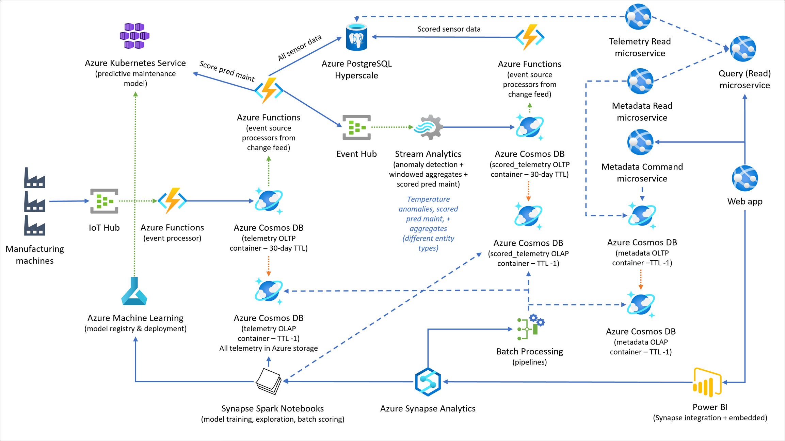
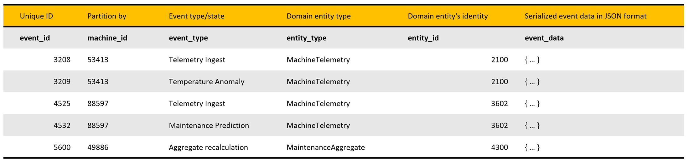
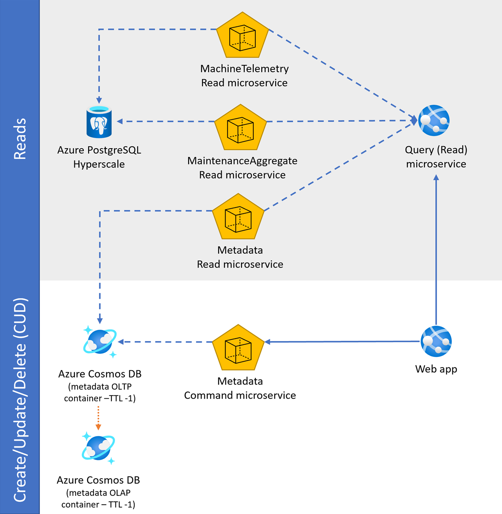

Innovate and modernize apps with Data and AI

Whiteboard design session trainer guide

August 2020

Information in this document, including URL and other Internet Web site references, is subject to change without notice. Unless otherwise noted, the example companies, organizations, products, domain names, e-mail addresses, logos, people, places, and events depicted herein are fictitious, and no association with any real company, organization, product, domain name, e-mail address, logo, person, place or event is intended or should be inferred. Complying with all applicable copyright laws is the responsibility of the user. Without limiting the rights under copyright, no part of this document may be reproduced, stored in or introduced into a retrieval system, or transmitted in any form or by any means (electronic, mechanical, photocopying, recording, or otherwise), or for any purpose, without the express written permission of Microsoft Corporation.

Microsoft may have patents, patent applications, trademarks, copyrights, or other intellectual property rights covering subject matter in this document. Except as expressly provided in any written license agreement from Microsoft, the furnishing of this document does not give you any license to these patents, trademarks, copyrights, or other intellectual property.

The names of manufacturers, products, or URLs are provided for informational purposes only and Microsoft makes no representations and warranties, either expressed, implied, or statutory, regarding these manufacturers or the use of the products with any Microsoft technologies. The inclusion of a manufacturer or product does not imply endorsement of Microsoft of the manufacturer or product. Links may be provided to third party sites. Such sites are not under the control of Microsoft and Microsoft is not responsible for the contents of any linked site or any link contained in a linked site, or any changes or updates to such sites. Microsoft is not responsible for webcasting or any other form of transmission received from any linked site. Microsoft is providing these links to you only as a convenience, and the inclusion of any link does not imply endorsement of Microsoft of the site or the products contained therein.

© 2020 Microsoft Corporation. All rights reserved.

Microsoft and the trademarks listed at <https://www.microsoft.com/legal/intellectualproperty/Trademarks/Usage/General.aspx> are trademarks of the Microsoft group of companies. All other trademarks are property of their respective owners.

**Contents**

<!-- TOC -->

- [Trainer information](#trainer-information)
  - [Role of the trainer](#role-of-the-trainer)
  - [Whiteboard design session flow](#whiteboard-design-session-flow)
  - [Before the whiteboard design session: How to prepare](#before-the-whiteboard-design-session-how-to-prepare)
  - [During the whiteboard design session: Tips for an effective whiteboard design session](#during-the-whiteboard-design-session-tips-for-an-effective-whiteboard-design-session)
- [Innovate and Modernize Apps with Data and AI whiteboard design session student guide](#innovate-and-modernize-apps-with-data-and-ai-whiteboard-design-session-student-guide)
  - [Abstract and learning objectives](#abstract-and-learning-objectives)
  - [Step 1: Review the customer case study](#step-1-review-the-customer-case-study)
    - [Customer situation](#customer-situation)
    - [Customer needs](#customer-needs)
    - [Customer objections](#customer-objections)
    - [Infographic for common scenarios](#infographic-for-common-scenarios)
  - [Step 2: Design a proof of concept solution](#step-2-design-a-proof-of-concept-solution)
  - [Step 3: Present the solution](#step-3-present-the-solution)
  - [Wrap-up](#wrap-up)
  - [Additional references](#additional-references)
- [Innovate and modernize apps with Data and AI whiteboard design session trainer guide](#innovate-and-modernize-apps-with-data-and-ai-whiteboard-design-session-trainer-guide)
  - [Step 1: Review the customer case study](#step-1-review-the-customer-case-study-1)
  - [Step 2: Design a proof of concept solution](#step-2-design-a-proof-of-concept-solution-1)
  - [Step 3: Present the solution](#step-3-present-the-solution-1)
  - [Wrap-up](#wrap-up-1)
  - [Preferred target audience](#preferred-target-audience)
  - [Preferred solution](#preferred-solution)
  - [Checklist of preferred objection handling](#checklist-of-preferred-objection-handling)
  - [Customer quote (to be read back to the attendees at the end)](#customer-quote-to-be-read-back-to-the-attendees-at-the-end)

<!-- /TOC -->

# Trainer information

Thank you for taking time to support the whiteboard design sessions as a trainer!

## Role of the trainer

An amazing trainer:

- Creates a safe environment in which learning can take place.

- Stimulates the participant's thinking.

- Involves the participant in the learning process.

- Manages the learning process (on time, on topic, and adjusting to benefit participants).

- Ensures individual participant accountability.

- Ties it all together for the participant.

- Provides insight and experience to the learning process.

- Effectively leads the whiteboard design session discussion.

- Monitors quality and appropriateness of participant deliverables.

- Effectively leads the feedback process.

## Whiteboard design session flow 

Each whiteboard design session uses the following flow:

**Step 1: Review the customer case study (15 minutes)**

**Outcome**

Analyze your customer's needs.

- Customer's background, situation, needs and technical requirements

- Current customer infrastructure and architecture

- Potential issues, objectives and blockers

**Step 2: Design a proof of concept solution (60 minutes)**

**Outcome**

Design a solution and prepare to present the solution to the target customer audience in a 15-minute chalk-talk format.

- Determine your target customer audience.

- Determine customer's business needs to address your solution.

- Design and diagram your solution.

- Prepare to present your solution.

**Step 3: Present the solution (30 minutes)**

**Outcome**

Present solution to your customer:

- Present solution

- Respond to customer objections

- Receive feedback

**Wrap-up (15 minutes)**

- Review preferred solution

## Before the whiteboard design session: How to prepare

Before conducting your first whiteboard design session:

- Read the Student guide (including the case study) and Trainer guide.

- Become familiar with all key points and activities.

- Plan the point you want to stress, which questions you want to drive, transitions, and be ready to answer questions.

- Prior to the whiteboard design session, discuss the case study to pick up more ideas.

- Make notes for later.

## During the whiteboard design session: Tips for an effective whiteboard design session

**Refer to the Trainer guide** to stay on track and observe the timings.

**Do not expect to memorize every detail** of the whiteboard design session.

When participants are doing activities, you can **look ahead to refresh your memory**.

- **Adjust activity and whiteboard design session pace** as needed to allow time for presenting, feedback, and sharing.

- **Add examples, points, and stories** from your own experience. Think about stories you can share that help you make your points clearly and effectively.

- **Consider creating a "parking lot"** to record issues or questions raised that are outside the scope of the whiteboard design session or can be answered later. Decide how you will address these issues, so you can acknowledge them without being derailed by them.

***Have fun**! Encourage participants to have fun and share!*

**Involve your participants.** Talk and share your knowledge but always involve your participants, even while you are the one speaking.

**Ask questions** and get them to share to fully involve your group in the learning process.

**Ask first**, whenever possible. Before launching into a topic, learn your audience's opinions about it and experiences with it. Asking first enables you to assess their level of knowledge and experience, and leaves them more open to what you are presenting.

**Wait for responses**. If you ask a question such as, "What's your experience with (fill in the blank)?" then wait. Do not be afraid of a little silence. If you leap into the silence, your participants will feel you are not serious about involving them and will become passive. Give participants a chance to think, and if no one answers, patiently ask again. You will usually get a response.

# Innovate and Modernize Apps with Data and AI whiteboard design session student guide

## Abstract and learning objectives

In this whiteboard design session, you will work with a group to design a solution for ingesting and preparing manufacturing device sensor data, as well as detecting anomalies in sensor data and creating, training, and deploying a machine learning model which can predict when device maintenance will become necessary.

At the end of this whiteboard design session, you will have learned how to capture Internet of Things (IoT) device data with Azure IoT Hub, process device data with Azure Stream Analytics, apply the Command and Query Responsibility Segregation (CQRS) pattern with Azure Functions, build a predictive maintenance model using an Azure Machine Learning notebook, deploy the model to an Azure Machine Learning model registry, deploy the model to an Azure Container Instance, and generate predictions with Azure Functions accessing a Cosmos DB change feed.  These skills will help you modernize applications and integrate Artificial Intelligence into the application.

## Step 1: Review the customer case study 

**Outcome**

Analyze your customer's needs.

Timeframe: 15 minutes

Directions:  With all participants in the session, the facilitator/SME presents an overview of the customer case study along with technical tips.

1. Meet your table participants and trainer.

2. Read all of the directions for steps 1-3 in the student guide.

3. As a table team, review the following customer case study.

### Customer situation

Wide World Importers (WWI) is a global manufacturing company that handles distribution worldwide. They manufacture more than 9,000 different SKUs. They have data coming from CNC machines and sensors, as well as Manufacturing Execution Systems (MES).

WWI has five factories, each with about 10,000 sensors, for a total of approximately 50,000 sensors sending data in real-time. Today, their sensor data is collected into a Kafka cluster and processed via a custom consumer application that aggregates the events and writes the results to PostgreSQL. They have an event data store that currently runs in PostgreSQL. A web app connects to the data store and reports the status of the factory floor.

WWI is running into scalability issues as they add manufacturing capacity, but in the course of addressing this concern, they would like to take the opportunity to modernize their infrastructure. In particular, they would like to modernize their solution to use microservices, and in particular, apply the Event Sourcing and Command and Query Responsibility Segregation (CQRS) patterns.

They recognize their solutions will benefit from the cloud and want to ensure that they can manage their hybrid solution in a consistent way across both cloud and on-premises resources. The factories currently collect and analyze their operational data independently. They would like to deploy a cloud-based platform to centralize and allow storage of all data across all factories.

### Customer needs

1. We want to centralize our factory sensor data into the cloud, using PaaS services wherever possible.

2. We want to replace our local installations of Apache Kafka with a service that does not require on-premises administrators.  Not all of our factories have dedicated Kafka administrators, which has led to avoidable data loss issues in the past.

3. The consumer group application we have built to process data from Kafka is our data pipeline bottleneck. When factory managers need to wait for information to come in, it typically is because the consumer group has fallen behind again.  We want a system that can keep up with the torrent of device data our sensors generate.

4. Our factories are spread out across the world, and factory managers are used to near-real-time responses from the web applications hosted on on-premises servers.  Instead of a pure cloud solution, we would like a hybrid cloud solution that allows our central office, located in the northwestern United States, to oversee operations while still enabling factory managers to get the information they need at the speed to which they are accustomed.

5. In addition to storing data in the cloud, we would like to integrate machine learning into our application processing, including detecting anomalies in sensor data and predicting when machine maintenance will be necessary based on sensor data.

6. We want to reduce our reliance on a classic web application server for data processing and move toward a microservice approach.

7. Our developers and administrators are very familiar with PostgreSQL and want to use this as the primary relational database on-premises and in Azure. We are concerned about performance in Azure, however--because we will collect data from all of our factories, we would like to have a solution which allows us to scale out our PostgreSQL services easily.

### Customer objections

1. We process a large amount of sensor data at each factory.  Will a cloud service be able to keep up with our data requirements?

2. Does Azure have any capabilities available to perform anomaly detection on our sensor data?  How quickly could we get such a service in place?

3. Will a hybrid Azure and on-premises solution require additional administrators?  We do not have the budget to hire new IT staff this fiscal year, and so we want to limit the amount of new maintenance work required.

4. How quickly could we add new sensors to this solution?  We have new manufacturing devices coming online and wish to expand the numbers of sensors on our existing devices, so we need a solution that will scale over time.

### Infographic for common scenarios

## Step 2: Design a proof of concept solution

**Outcome**

Design a solution and prepare to present the solution to the target customer audience in a 15-minute chalk-talk format.

Timeframe: 60 minutes

**Business needs**

Directions: With all participants at your table, answer the following questions and list the answers on a flip chart:

1. Who should you present this solution to? Who is your target customer audience? Who are the decision makers?

2. What customer business needs do you need to address with your solution?

**Design**

Directions: With all participants at your table, respond to the following questions on a flip chart:

*High-level architecture*

1. Without getting into the details (the following sections will address the particular details), diagram your initial vision for building a hybrid data services approach, combining on-premises infrastructure with Azure, along with custom dashboards, real-time anomaly detection, and predictive maintenance.  If you can, include the underlying architecture of the solution by identifying its major components.

*IoT options in Azure*

1. What are the SaaS-based IoT options in Azure?

2. What are the PaaS-based IoT options in Azure?

3. Would you recommend SaaS or PaaS for this customer situation? What are the pros and cons of each?

*Hybrid IoT data management*

1. How do you collect data from on-premises devices and share it between on-premises services and cloud services?

2. How do you aggregate or re-shape IoT data for consumption by downstream services?

3. Will Wide World Importers be able to support a major influx of new sensors with this solution?

*Event sourcing*

1. What does event sourcing mean in practice?  What kinds of considerations should Wide World Importers take when migrating from a classic application architecture to an event sourcing pattern?

2. How can the events flowing through the architecture be processed at scale?

3. How should WWI implement the CQRS pattern in their new microservices-based web application? Provide some samples of domain entities they can use to store the event data along with state information.

*Anomaly detection*

1. Given historical data for a sensor, how would you propose Wide World Importers detect anomalies?

2. How would this process integrate with their IoT data management solution?

*Predictive maintenance*

1. Wide World Importers has an extensive amount of sensor data going back years and wish to train a model for predictive maintenance based on this sensor data. What technologies would help them train the model given this data size?

2. Which platform would you recommend for deploying the trained model?  This deployed model should still be part of an event sourcing solution.

**Prepare**

Directions: With all participants at your table:

1. Identify any customer needs that are not addressed with the proposed solution.

2. Identify the benefits of your solution.

3. Determine how you will respond to the customer's objections.

Prepare a 15-minute chalk-talk style presentation to the customer.

## Step 3: Present the solution

**Outcome**

Present a solution to the target customer audience in a 15-minute chalk-talk format.

Timeframe: 30 minutes

**Presentation**

Directions:

1. Pair with another table.

2. One table is the Microsoft team and the other table is the customer.

3. The Microsoft team presents their proposed solution to the customer.

4. The customer makes one of the objections from the list of objections.

5. The Microsoft team responds to the objection.

6. The customer team gives feedback to the Microsoft team.

7. Tables switch roles and repeat Steps 2-6.

## Wrap-up

Timeframe: 15 minutes

Directions: Tables reconvene with the larger group to hear the facilitator/SME share the preferred solution for the case study.

## Additional references

|    |            |
|----------|:-------------:|
| **Description** | **Links** |
| Azure IoT reference architecture | https://docs.microsoft.com/azure/architecture/reference-architectures/iot |
| What is Azure IoT Hub? | https://docs.microsoft.com/azure/iot-hub/about-iot-hub |
| What is Azure IoT Edge  | https://docs.microsoft.com/azure/iot-edge/about-iot-edge  |
| What is Azure Stream Analytics? | https://docs.microsoft.com/azure/stream-analytics/stream-analytics-introduction  |
| Anomaly detection in Azure Stream Analytics  | https://docs.microsoft.com/azure/stream-analytics/stream-analytics-machine-learning-anomaly-detection  |
| Cognitive Services Anomaly Detector  | https://azure.microsoft.com/services/cognitive-services/anomaly-detector/  |
| Azure Synapse Link for Cosmos DB | https://docs.microsoft.com/azure/cosmos-db/synapse-link |
| What is Azure Cosmos DB Analytical Store? | https://docs.microsoft.com/azure/cosmos-db/analytical-store-introduction |
| Azure Database for PostgreSQL | https://azure.microsoft.com/services/postgresql/ |
| An introduction to Azure Functions | https://docs.microsoft.com/azure/azure-functions/functions-overview |
| Tutorial: Run Azure Functions from Azure Stream Analytics jobs | https://docs.microsoft.com/azure/stream-analytics/stream-analytics-with-azure-functions |
| What is Azure Synapse Analytics? | https://docs.microsoft.com/azure/synapse-analytics/overview-what-is |
| Build a machine learning app with Apache Spark MLlib and Azure Synapse Analytics | https://docs.microsoft.com/azure/synapse-analytics/spark/apache-spark-machine-learning-mllib-notebook |
| Create and run machine learning pipelines with Azure Machine Learning SDK | https://docs.microsoft.com/azure/machine-learning/how-to-create-your-first-pipeline |
| Use an existing model with Azure Machine Learning | https://docs.microsoft.com/azure/machine-learning/how-to-deploy-existing-model |
| Tutorial: Deploy an image classification model in Azure Container Instances | https://docs.microsoft.com/azure/machine-learning/tutorial-deploy-models-with-aml |
| Command and Query Responsibility Segregation (CQRS) pattern | https://docs.microsoft.com/azure/architecture/patterns/cqrs |
| Implement a microservice domain model with .NET Core | https://docs.microsoft.com/dotnet/architecture/microservices/microservice-ddd-cqrs-patterns/net-core-microservice-domain-model |

# Innovate and modernize apps with Data and AI whiteboard design session trainer guide

## Step 1: Review the customer case study

- Check in with your table participants to introduce yourself as the trainer.

- Ask, "What questions do you have about the customer case study?"

- Briefly review the steps and timeframes of the whiteboard design session.

- Ready, set, go! Let the table participants begin.

## Step 2: Design a proof of concept solution

- Check in with your tables to ensure that they are transitioning from step to step on time.

- Provide some feedback on their responses to the business needs and design.

  - Try asking questions first that will lead the participants to discover the answers on their own.

- Provide feedback for their responses to the customer's objections.

  - Try asking questions first that will lead the participants to discover the answers on their own.

## Step 3: Present the solution

- Determine which table will be paired with your table before Step 3 begins.

- For the first round, assign one table as the presenting team and the other table as the customer.

- Have the presenting team present their solution to the customer team.

  - Have the customer team provide one objection for the presenting team to respond to.

  - The presentation, objections, and feedback should take no longer than 15 minutes.

  - If needed, the trainer may also provide feedback.

## Wrap-up

- Have the table participants reconvene with the larger session group to hear the facilitator/SME share the following preferred solution.

## Preferred target audience

Molly Fischer, Chief Information Officer (CIO), Wide World Importers

The primary audience is business and technology decision-makers. From the case study scenario, it would include the Director of Analytics. Usually, we talk to the infrastructure managers who report to the chief information officer (CIO), or to application sponsors, such as a line of business (LOB) vice president (VP), chief marketing officer (CMO), or to those who represent the business unit IT or developers who report to application sponsors.

## Preferred solution

*High-level architecture*

1. Without getting into the details (the following sections will address the particular details), diagram your initial vision for building a hybrid data services approach, combining on-premises infrastructure with Azure, along with custom dashboards, real-time anomaly detection, and predictive maintenance. If you can, include the underlying architecture of the solution by identifying its major components.

The solution begins with multiple IoT devices, located within multiple factories, that securely connect to Azure IoT Hub to send telemetry. IoT Hub provides IoT device management, telemetry ingest at high volume, and the ability to send commands to devices as needed. IoT Edge allows individual manufacturing machines to interact with IoT Hub by sending telemetry messages to IoT Hub and by ensuring that edge devices are running the latest versions of deployed modules. Telemetry from IoT Hub automatically triggers an Azure function, which processes the events, assigns a unique `entity_id`, and stores them in an Azure Cosmos DB telemetry container. The document TTL (time-to-live) is set to 30 days, after which time they will automatically expire. The data is replicated long-term to the analytical store with no TTL. The analytical store saves all transactional data in columnar storage as Parquet files in Azure storage in a cost-effective way, automatically. No ETL required. A different Azure function implements event sourcing by triggering off the Azure Cosmos DB change feed for additional processing, including predictive maintenance scoring via a custom-trained Machine Learning model deployed to Azure Kubernetes Service (AKS) for real-time scoring. The function sends the scored data to an Azure Event Hub. Another function that consumes the change feed and saves the event data to domain entities, including state data, and stores them in Azure PostgreSQL Hyperscale (Citus). This database stores all sensor data as domain entities, partitioned by device Id, which the Hyperscale features uses to automatically shard the data for horizontal scaling and high performance reads and writes. An Azure Stream Analytics job reads the device telemetry, which includes the predictive maintenance prediction, and applies additional processing through a SQL-like query language. It uses an Azure Cognitive Services Anomaly Detector service to perform Changepoint and Spike-and-Dip anomaly detection. It also performs windowed aggregate queries against the time series data to create aggregates on machine maintenance predictions, grouped by maintenance requirement, factory, and machine. The temperature anomalies, telemetry with predictive maintenance scores, and temperature anomaly data is saved to another Azure Cosmos DB container, named `scored_telemetry`. Another Azure function implements event sourcing by triggering off the Azure Cosmos DB change feed from the `scored_telemetry` container. It saves the anomaly detection, windowed aggregates, and scored predictive maintenance event data to domain entities, including state data, and writes them to Azure PostgreSQL.

An Azure Synapse Analytics workspace securely connects to Azure Cosmos DB through a linked service, and uses the Synapse Link feature to access both the transactional store (OLTP) and analytical store (OLAP) of each Azure Cosmos DB container. The analytical store is optimized for read-heavy queries, which do not consume Azure Cosmos DB resource units (RUs), as opposed to reading the transactional store. All raw historical event data is accessible through the analytical store, which serves as the data lake, but with no ETL requirements. Synapse Spark notebooks read the analytical store to perform Machine Learning model training and deployments through Azure Machine Learning, data exploration, and batch scoring. Synapse pipelines are used for batch processing at scale over data fed into the analytical store from IoT devices originating from all factories. Wide World Importers data analysts use the Power BI integration capabilities of Synapse Analytics to create reports against Synapse Serverless views that display data from the analytical stores, as well as data stored in the SQL Pools. These reports are also embedded in the web application, making them available to end-users who do not have access to the Synapse Analytics workspace or Power BI online.

The web app is a modernized version of WWI's old monolithic web app, implementing a microservices pattern through Docker containers deployed to Azure. The CQRS pattern is applied by separating create, update, and delete (CUD) commands from query (read) commands, issued by microservices deployed to different containers. The metadata command microservice, for example, issues CUD commands to the `metadata` Azure Cosmos DB container. Factory, machine, maintenance criteria, and other metadata are stored in this container. A query microservice issues read requests to read microservices for telemetry data stored in Azure PostgreSQL, and metadata stored in Azure Cosmos DB.

*IoT options in Azure*

1. What are the SaaS-based IoT options in Azure?

    Azure IoT Central is an end-to-end SaaS solution that provides the most common features used in a broad range of IoT solutions without requiring cloud-based development expertise. Most of the configuration can be done through the provided web-based UI, and device management follows a model-based approach where device templates are created to define IoT device metadata for simplified management. Devices are added to a device set that is based on a version of the template, organizing like-devices for reporting and management. Although IoT Central uses several Azure services under the covers, such as IoT Hub, those details are hidden from the user, allowing them to focus on customizing their personalized IoT Central application through its innovative UI.

2. What are the PaaS-based IoT options in Azure?

    Azure IoT Hub is a PaaS service that allows users to connect and manage millions of IoT devices, ingest millions of events per second from these devices, automate IoT device provisioning, and cloud-to-device messaging for command and control. IoT Hub also helps enforce security on devices through per-device identity, allowing operators and admins to authorize and revoke device connections. Azure IoT solution accelerators are packaged solutions built on top of IoT Hub and other Azure components to kick-start PaaS-based IoT projects. When using Azure IoT solution accelerators, you have access to the underlying Azure services of the solution as well as the source code that comes with the starter solution. The flexibility level is high, but so is the skill level to customize the accelerator to your needs.

    Both IoT Central and Azure IoT solution accelerators use IoT Hub along with other Azure services. However, these are not needed to use IoT Hub by itself in your own custom solution.

3. Would you recommend SaaS or PaaS for this customer situation? What are the pros and cons of each?

    Wide World Importers stated their interest in PaaS-based solutions that can handle managing and ingesting their existing IoT devices, and easily scale to support future growth as they bring more factories online. Azure IoT Hub's features meet the base requirements for their PoC, and can easily scale to manage and ingest telemetry from millions of devices. Since they already have staff on-hand who have IoT development and device management expertise, IoT Hub offers more advanced capabilities and flexibility to fit into their existing architecture as they transition to their new Azure-based architecture. Long-term, using IoT Hub for device management and ingest as an entry point into their custom event sourcing architecture is more cost-effective than using Azure IoT Central.

    There are some additional drawbacks to WWI using IoT Central, as with any SaaS-based solution. The primary drawback is limited flexibility because the underlying infrastructure is not customizable because its components are not exposed. WWI will need to find workarounds if ever their requirements change, and they need customization beyond what is provided by IoT Central's interface and SDK. Another limiting factor is how data is accessed. Although all the data is stored within a time-series data store, you only have access to it either through IoT Central's UI, which offers flexible filtering and visualizations, or by enabling continuous export of data to Azure Storage, Azure Event Hubs, or Azure Service Bus. You cannot directly query the datastore from an external application.

    Creating a microservices-based IoT solution with IoT Hub and their own web application and related services, or by starting with an Azure IoT solution accelerator, gives WWI maximum flexibility. They have full control over the development and deployment lifecycle of their solution, including automated deployments to development, staging, and production environments. The primary drawbacks to this approach are increased time to develop and deploy the solution, required expertise for end-to-end IoT development and customization, and a more opaque pricing structure where they must fine-tune the services to control costs.

    All in all, given their requirements, using the PaaS-based IoT Hub service is the recommended approach for WWI.

*Hybrid IoT data management*

1. How do you collect data from on-premises devices and share it between on-premises services and cloud services?

    Using IoT Edge, Wide World Importers can develop code in languages like C#, Java, Node.js, and Python to run on edge devices.  This code will interface with sensors on the edge devices, collecting signal data and converting it to telemetry data.  Each IoT Edge device is assigned to a particular IoT Hub and interactions between the two are seamless--as long as there is an Internet connection, edge devices can broadcast messages on their own schedules to IoT Hub.

    From there, data in IoT Hub can be partitioned by factory, allowing downstream readers such as the Azure Function acting as an event processor to send messages back to the factories' PostgreSQL databases as well as pushing those messages on toward the `telemetry` container in Cosmos DB. This eliminates the need to manage a separate Apache Kafka cluster at each factory and thereby reduces the burden on the IT staff at each factory.

2. How do you aggregate or re-shape IoT data for consumption by downstream services?

    There are a few techniques for aggregating and reshaping IoT data.  In this whiteboard design session, we see the heavy use of Azure Functions to process individual messages and perform a variety of transformations.  In other scenarios, products like Azure Stream Analytics can aggregate and reshape device messages for ingestion into data platform technologies such as Cosmos DB and Azure SQL Database.

3. Will Wide World Importers be able to support a major influx of new sensors with this solution?

    Absolutely.  It is possible to register IoT Edge devices programmatically with IoT Hub, meaning that hundreds or even thousands of device configurations can be assigned from a central administrative server.  From there, IoT Edge devices may be automatically configured as part of the setup process, eliminating the need for manually linking IoT Edge devices to an IoT Hub.

*Event sourcing*

1. What does event sourcing mean in practice? What kinds of considerations should Wide World Importers take when migrating from a classic application architecture to an event sourcing pattern?

    A vital pattern used in the preferred solution is the [event sourcing pattern](https://docs.microsoft.com/azure/architecture/patterns/event-sourcing). This pattern defines an approach to handling operations on data that's driven by a sequence of events, each of which is recorded in an append-only store. In our implementation, IoT devices send telemetry as a series of events that imperatively describe the state of each device over time to the event store, where they're persisted. Each event represents a set of changes to the data, which is tied back to the source IoT device.

    The event store acts as the system of record (the authoritative data source) about the current state of the data. The event store used in the solution accelerator is an [Azure Cosmos DB](https://docs.microsoft.com/azure/cosmos-db/introduction) `telemetry` container that is tuned for write-heavy workloads through minimal indexing, partitioning on a key with high cardinality, and by setting a throughput adjusted for a high rate of ingesting. The Azure Cosmos DB change feed is used to publish these events so that consumers are notified so they can handle them if needed. The `scored_telemetry` container also acts as an event source for scored predictive maintenance, temperature anomaly, and windowed aggregate events.

    Typical uses of the events published by the change feed are to maintain materialized views of entities as telemetry is ingested or actions in the application change them, and for integration with external systems. For example, as device telemetry is saved, materialized views are updated with aggregated information about the IoT device telemetry, which is used to populate parts of the UI such as dashboards and reports. The aggregated data in this example is saved to a different container in Azure Cosmos DB, eliminating the need to query against the event collection and perform expensive aggregates across multiple partitions. All telemetry data is stored in Azure PostgreSQL as entity data with state information, as well.

    Implementing the event sourcing pattern allows data and software architects to think beyond typical CRUD operations that may be used to for their databases and applications. The components of the event sourcing pattern are loosely coupled and can often operate in parallel for maximum scalability. This pattern helps these architects consider how they can handle the rising velocity, variety, and volume of data in today's Big Data landscape.

2. How can the events flowing through the architecture be processed at scale?

    In the architecture for this scenario, Azure Functions play a major role in event processing. These functions execute within an Azure Function App, Microsoft's serverless solution for easily running small pieces of code, or "functions," in the cloud. You can write just the code you need for the problem at hand, without worrying about a whole application or the infrastructure to run it. Functions can make development even more productive, and you can use your development language of choice, such as C#, F#, Node.js, Java, or PHP.

    This architecture uses multiple Function Apps because of how functions scale to meet demand. When you use the Azure Functions consumption plan, you only pay for the time your code runs. More importantly, Azure automatically handles scaling your functions to meet demand. It scales using an internal scale controller that evaluates the type of trigger the functions are using and applies heuristics to determine when to scale out to multiple instances. The important thing to know is that functions scale at the Function App level. Meaning, if you have one very busy function and the rest are mostly idle, that one busy function causes the entire Function App to scale. Think about this when designing your solution. It is a good idea to *divide extremely high-load functions into separate Function Apps*.

3. How should WWI implement the CQRS pattern in their new microservices-based web application? Provide some samples of domain entities they can use to store the event data along with state information.

    According to the Azure cloud design patterns documentation, the [Command and Query Responsibility Segregation (CQRS) pattern](https://docs.microsoft.com/azure/architecture/patterns/cqrs) separates read and update operations for a data store. Implementing CQRS in WWI's microservices-based application can maximize its performance, scalability, and security. The flexibility created by migrating to CQRS allows a system to better evolve over time and prevents update commands from causing merge conflicts at the domain level. There are multiple microservices in play throughout the solution. The Azure Functions act as microservices that perform insert operations into different data stores, such as various Azure Cosmos DB containers and Azure PostgreSQL. The web application is composed of microservices that are responsible for applying domain-specific business logic and data operations.

    In traditional architectures, the same data model is used to query and update a database, which is simple and works well for basic create, read, update, and delete (CRUD) operations. In more complex applications with multiple data sources, data stores, and data velocities, this approach can become unwieldy. For example, on the read side, the application may perform many different queries, returning domain entities with different shapes. Object mapping can become complicated. On the write side, the model may implement complex validation and business logic. As a result, you can end up with an overly complex model that does too much.

    As seen in WWI's case, read and write workloads are often asymmetrical, with very different performance and scale requirements. Separating these workloads into separate services helps address system configuration, security, and scale requirements that apply differently to each workload.

    **Sample domain entities:**

    | Entity Type | Description |
    | --- | --- |
    | **MachineTelemetry** | Contains telemetry event data (serialized in JSON format) and event type (state) information |
    | **MaintenanceAggregate** | Contains windowed aggregates for machine maintenance predictions, grouped by maintenance requirement, factory, and machine |
    | **Metadata** | Contains metadata for factories (name, location), machines, and maintenance information |

    All raw event data lands in Azure Cosmos DB with a relatively short TTL (~30 days). The data is replicated long-term to the analytical store with no TTL. The analytical store saves all transactional data in columnar storage as Parquet files in Azure storage in a cost-effective way, automatically. No ETL required. In addition, the analytical store helps WWI apply the CQRS pattern by issuing complex read operations against a read-only data store that is optimized for analytical workloads.

    The event source processors (Azure Functions) conform event data to the domain entities (outlined above) and save the entities to its respective storage (Cosmos DB container directly or through Event Hubs and an Azure PostgreSQL Hyperscale database). These processors act as microservices that save the data through CUD commands (CQRS pattern). These commands can be queued and be applied asynchronously. Depending on the data sink, additional event processing occurs downstream (Cosmos DB change feed). The function triggered by IoT Hub generates the `entity_id` value. Cosmos DB generates the `event_id`, which maps to the document's id field. The `machine_id` is supplied by the incoming telemetry and is used as the partition key in PostgreSQL for automated sharding and creating materialized views.

    The following table shows how event data that contains state information (`event_type`) can be stored in PostgreSQL. All event data is stored in JSON format within the `event_data` field. The built-in JSON capabilities of PostgreSQL can directly access the data in this field for executing queries and other data operations.

    

    The CQRS pattern also applies to the microservices used by the new web application. In the diagram below, there is a clear line of delineation between microservices that perform create, update, and delete (CUD) operations, and those optimized for query (Read) operations. The web app uses the metadata command service to create, update, and delete metadata records stored in the `metadata` Azure Cosmos DB container. A Query microservice issues read commands against `MachineTelemetry`, `MaintenanceAggregate`, and `Metadata` microservices, which are responsible for querying their respective data stores.

    

*Anomaly detection*

1. Given historical data for a sensor, how would you propose Wide World Importers detect anomalies?

    If Wide World Importers has historical data which includes whether values were anomalous, then a classification model could help separate anomalous from non-anomalous data.  Typically, however, we tend to have recent history but no labels indicating what, in fact, was anomalous.  This leads us to other techniques for anomaly detection comparing the direction and distance of changes over time.

    Within Azure, Cognitive Services includes [an Anomaly Detector service](https://azure.microsoft.com/services/cognitive-services/anomaly-detector/).  This service allows you to pass in a time series set of data points and determine if the most recent data point is anomalous given the inputs.  This is available as an API you can call from languages like C#, JavaScript, or Python; it is also available as a REST API if there is not a [Software Development Kit (SDK) for your language of choice](https://docs.microsoft.com/azure/cognitive-services/anomaly-detector/).

    The Anomaly Detector service is also included in Azure Stream Analytics, allowing for easy processing of data points over time in just a few lines of code.

2. How would this process integrate with their IoT data management solution?

    Azure Stream Analytics jobs can have as destinations data platform technologies like Cosmos DB and Azure SQL Database.  If the IoT data management solution is already in Azure, it is easy to configure that system as an output and feed anomaly data into the solution.  If not, storing the data in Cosmos DB allows use of the Cosmos DB change feed to fire Azure Functions, and these functions can send anomaly information to a destination database.

*Predictive maintenance*

1. Wide World Importers has an extensive amount of sensor data going back years and wish to train a model for predictive maintenance based on this sensor data. What technologies would help them train the model given this data size?

    Typically, predictive maintenance model development happens in a language such as R or Python on a single machine.  With enormous amounts of data, however, data scientists can quickly run out of memory on local laptops.  For this reason, Azure Machine Learning allows data scientists to provision compute resources, including clusters which allow for complex, memory-hungry algorithms to process large amounts of data.

2. Which platform would you recommend for deploying the trained model? This deployed model should still be part of an event sourcing solution.

    Given that the deployed model will be part of an event sourcing solution, it is important that the model return results quickly and generate predictions in a streaming fashion rather than in batches.  For this reason, deployment on Azure Machine Learning using Azure Kubernetes Service is an ideal solution:  the ability to scale out with Kubernetes allows IT administrators to control prediction performance by increasing the number of nodes available for responding to queries, and Azure Machine Learning deployments offer a REST API which makes it easy to interface with events being handled through Azure Functions.

## Checklist of preferred objection handling

1. We process a large amount of sensor data at each factory.  Will a cloud service be able to keep up with our data requirements?

    Yes!  [Azure IoT Hub can scale to 6,000 device-to-cloud send operations per unit per second](https://docs.microsoft.com/azure/iot-hub/iot-hub-devguide-quotas-throttling), with a total of 50 IoT hubs per Azure subscription. Each IoT Hub unit can support 300,000,000 messages per day, so if we assume a device sends an update every five seconds, we can support over 17,000 devices on a single IoT Hub, or just over 868,000 in a subscription.

2. Does Azure have any capabilities available to perform anomaly detection on our sensor data?  How quickly could we get a service in place?

    Within Cognitive Services, there is an Anomaly Detector service available. This service allows customers to query a REST API or integrate directly with a client library to perform anomaly detection on time series data.

    Furthermore, this anomaly detection engine is built into Azure Stream Analytics, allowing you to perform Changepoint and Spike-and-Dip anomaly detection with streamed data.

3. Will a hybrid Azure and on-premises solution require additional administrators?  We do not have the budget to hire new IT staff this fiscal year, and so we want to limit the amount of new maintenance work required.

    With the proposed solution, this new architecture will not require additional administrators. Replacing Apache Kafka with IoT Hub would take Wide World Importers from a self-hosted system with significant maintenance requirements to a Platform-as-a-Service solution with little maintenance. Relying heavily on Platform-as-a-Service technologies like Azure Database for PostgreSQL, Cosmos DB, and Azure Machine Learning enable developer solutions without burdening administrators.

4. How quickly could we add new sensors to this solution?  We have new manufacturing devices coming online and wish to expand the numbers of sensors on our existing devices, so we need a solution which will scale over time.

    With the proposed solution, adding a new device or a new sensor means configuring the sensor to use Azure IoT Edge to communicate with the existing IoT Hub. All of the other pieces continue to work as expected with no additional development effort, and all of the Platform-as-a-Service solutions allow for scaling out over time as Wide World Importers further automates its business.

## Customer quote (to be read back to the attendees at the end)

"We thought we were at the forefront of technological innovation, but this engagement taught us just how much room we have to grow."

-- Molly Fischer, CIO, Wide World Importers.
